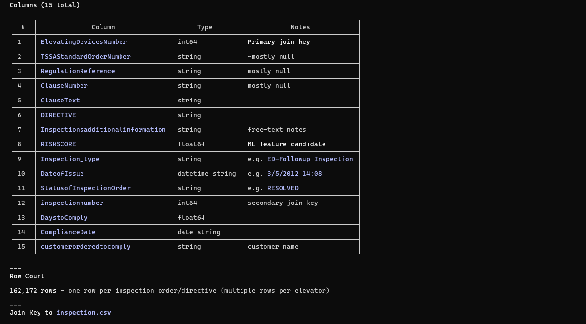
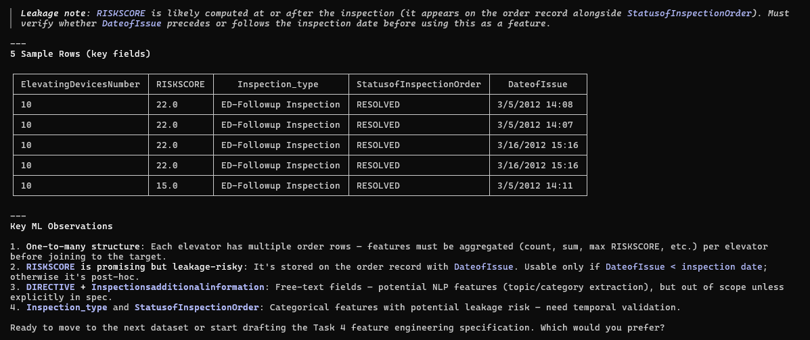

# AI Interaction Log — Module 101

## Summary: Evolution of AI-Assisted Development Through Module 101

Over the course of Module 101, my understanding of how to effectively collaborate with AI shifted from viewing it primarily as a content generator to recognizing it as a partner in iterative, data-driven design. This evolution was driven by concrete friction points and surprises that forced me to re-examine my assumptions about prompting, specification writing, and verification.

### Prompting: From Open-Ended Requests to Constraint-Driven Precision

Early interactions taught me that prompting quality directly correlates to output precision. My initial README prompt was loose—it generated features that hadn't been implemented yet and created unnecessary content. Reframing the task with explicit constraints (module scope, no future assumptions) eliminated over-generation. This pattern repeated across multiple tasks: structured prompts with clear boundaries consistently outperformed open-ended requests.

But prompting is not one-size-fits-all. I discovered that the three main techniques—zero-shot, few-shot, and chain-of-thought—serve different purposes. Zero-shot prompting provided fast baselines for straightforward classification tasks. Few-shot prompting excelled when edge cases required contextual grounding (e.g., interpreting ambiguous license statuses). Chain-of-thought prompting was essential for complex reasoning and for catching misinterpretations hidden in technically correct results.

This last lesson emerged painfully: my data analysis task produced a result claiming 100% of licenses were expired. The calculation was correct—mathematically sound—but operationally meaningless because the dataset is historical. Only chain-of-thought prompting surfaced this insight, forcing explicit reasoning about data provenance. Simpler techniques accepted the dataset as current. The lesson: data interpretation requires context, and reasoning-focused prompts help distinguish calculations from meaningful insights.

### From Specifications as Documents to Specifications as Control

Specifications started as a way to document requirements. They evolved into something more powerful: a single source of truth that could drive both implementation and visual refinement without manual code edits.

This evolution was enabled by a critical upstream shift: verifying data early. My initial dashboard specification assumed field names without checking the actual datasets. When I aligned the specification with real schemas—confirming which fields existed, how they were named, and what gaps existed—the specification became genuinely actionable. A specification grounded in real data constraints is more valuable than one built on reasonable assumptions.

Once the specification was data-aware, it became an effective control mechanism. Instead of editing HTML directly when visual design needed improvement, I updated the specification with branding guidance and regenerated the entire dashboard. This kept intent and implementation aligned and prevented the inconsistencies that manual tweaks introduce. The specification became the single source of truth, and regeneration became the standard workflow.

### The Role of Data Verification as a Foundation

Data exploration is not separate from downstream work—it is prerequisite work. When I verified `ElevatingDevicesNumber` as a unique identifier, validated that ACTIVE and BY REQUEST were the operational statuses, and confirmed schema alignment across datasets, I was not just exploring. I was establishing foundations that everything downstream depended on.

This upfront verification accelerated implementation. The dashboard specification could be written confidently because the data constraints were known. The static HTML could be generated without follow-up questions. The prompting lab analysis could be interpreted correctly because I understood the dataset's provenance.

Conversely, skipping verification created rework: initial spec assumptions about field availability required correction. The solution was not to be more careful with guesses but to verify systematically before writing specifications.

### Project Structure and Workflow Payoff

An early decision to define clear directory structure (data/, docs/, intelligence/, platform/) seemed routine but paid surprising dividends. Having a settled structure eliminated hesitation when creating new artifacts. New notebooks, specifications, and dashboards had an obvious home, reducing context-switching friction. This reinforces a broader principle: upfront investment in scaffolding pays off quickly when the actual work begins.

### Honest Failures and What They Revealed

Two significant friction points stood out. First, I initially over-generated content when prompts were too open-ended. The README generated features not yet implemented. The initial dashboard specification included design details that belonged in a UI wireframe, not a technical spec. These failures traced directly to prompts that lacked constraints. The fix was not to be smarter about reading AI output but to be more deliberate about what I asked for.

Second, tooling friction appeared when working with Jupyter notebooks. Notebook cell edits required verification after completion. This was frustrating in the moment but served a deeper purpose: it reinforced the importance of validating structured outputs rather than assuming they are correct.

### Implications for Future Modules

These patterns will shape how I approach AI-assisted work going forward:

1. **Specifications should be complete from the start.** Branding, visual hierarchy, and design decisions should be specification-driven, not afterthoughts. This prevents visual iteration from becoming a series of manual code edits.

2. **Data verification precedes specification writing.** Before describing what the dashboard should display, I need to know exactly what data is available, what constraints exist, and how datasets join.

3. **Prompting is technique selection, not a single skill.** I will continue to use chain-of-thought for reasoning tasks, few-shot for edge cases, and zero-shot as a baseline, rather than defaulting to any single approach.

4. **Iteration on AI output is more efficient than regeneration from scratch.** When feedback is clear and targeted, guiding AI through revisions produces better results than asking for a complete redo. This was true for the README and the dashboard specification alike.

5. **Structured verification is not optional.** Before accepting AI-generated content—especially for data analysis or calculations—I should verify outputs against source data and ask clarifying questions about context and assumptions.

The overall shift is from treating AI as a tool that produces complete, polished artifacts to treating it as a collaborator in an iterative process where clarity of intent, early verification, and targeted feedback produce better results than hoping for the perfect first attempt.

---

## Entry – Monorepo Setup: Defining Project Structure for Module 101

**Task:** Set up the initial monorepo structure, directory layout, and project organization to support Module 101 work.

**Interaction summary:**
I worked with Claude Code to define a clear directory structure (data/, docs/, intelligence/) and establish initial project documentation before writing specifications or dashboards. This required translating loose course requirements into a concrete, usable repository layout without over-engineering for future modules.

**What worked:**
The straightforward separation of concerns made it immediately clear where datasets, specifications, notebooks, and logs belonged. This structure reduced friction in later tasks, as new artifacts could be placed confidently without revisiting organizational decisions.

**What was unexpected:**
Defining the structure early significantly accelerated later tasks. Having a settled structure eliminated hesitation and context-switching when moving between specification, dashboard development, and data analysis.

**Lesson learned:**
Upfront investment in project structure pays off quickly. Repository organization should emerge from the actual scope of work (Module 101), not from generic best practices aimed at hypothetical future needs.

---

## Entry – Updating README with Claude Code

**Task:** Update README.md to meet Task 1 requirements.

**Prompt used:**
"Update the existing README.md to include the project name, a one-paragraph description, and a list of the four main directories with explanations. Keep it concise and limited to Module 101."

**What worked:**
Claude Code produced a clean, well-structured README that clearly listed the required directories and aligned with the project scope. The concise prompt helped avoid unnecessary features or future assumptions.

**What didn't work or was unexpected:**
In an earlier attempt, a less structured prompt led Claude to mention features not yet implemented, which required manual correction, in addition to creating a new README.md instead of modifying the existing one.

**What I'd change next time:**
Be explicit about constraints (e.g., module scope, no future features) to reduce over-generation.

**Lesson learned:**
Structured, constraint-driven prompts lead to more accurate documentation updates than open-ended requests, especially when modifying existing files instead of generating new ones.

---

## Entry – Refining AI Workflow Baseline

**Task:** Create the AI workflow baseline document for Module 101.

**Interaction summary:**
While drafting the initial version of the AI workflow baseline, I realized the content felt too superficial and did not accurately reflect my real usage of AI tools. I reframed the task by answering more detailed, self‑reflective questions before structuring the document.

**What worked:**
Answering the questions in Spanish and from real experience resulted in a more honest and technically accurate baseline. This helped surface patterns in how I actually rely on AI during development work.

**What was unexpected:**
I underestimated how much nuance I had developed in my AI usage until I was forced to articulate it explicitly.

**Lesson learned:**
Baseline documentation is most valuable when it reflects real behavior, not an idealized workflow. Taking time to reflect before structuring the document leads to more meaningful results.

---

## Entry – License Dataset Analysis: Identifier Selection, Filtering, and Validation

**Task:** Analyze the license dataset (intelligence/license_analysis.ipynb) to identify a unique elevator identifier and create a clean, operational subset of the data.

**Interaction summary:**
Using pandas, I verified ElevatingDevicesNumber as the unique identifier, examined the distribution of LICENSESTATUS values, applied deliberate filtering decisions (keeping ACTIVE and BY REQUEST), and validated that uniqueness was preserved after filtering. I also extracted geographic information and created a license expiration timeline visualization.

**What worked:**
Treating identifier selection as a verification step rather than an assumption ensured safe cross-dataset joins later. Filtering to operational statuses produced a dataset aligned with the dashboard's operational focus. Post-filter validation confirmed data integrity was preserved.

**What was unexpected:**
The license expiration timeline revealed most expirations clustered in earlier years, indicating the dataset is historical. This insight later helped correctly interpret prompting lab results that showed all licenses as expired.

**What I'd change next time:**
Document the filtering rationale (why ACTIVE and BY REQUEST) even earlier to make future reuse of the dataset more explicit.

**Lesson learned:**
Data exploration should answer concrete operational questions before enabling downstream artifacts. Verifying assumptions early avoids compounding errors and strengthens confidence in data-driven decisions.

---

## Entry – Cross-Dataset Schema Alignment: Validating Join Fields Across Datasets

**Task:** Validate schema relationships across license.csv, inspection.csv, and installed.json to support a data-aware dashboard specification.

**Interaction summary:**
I confirmed that all relevant datasets share a common elevator identifier (ElevatingDevicesNumber, with a naming variation in installed.json) and documented this join explicitly in the dashboard specification. This ensured the spec reflected real data constraints rather than assumptions.

**What worked:**
Explicitly documenting joins and dataset sources in the specification created a single source of truth and prevented the dashboard implementation from guessing join logic or field availability.

**What didn't work or was unexpected:**
Initial spec drafts assumed certain fields existed without verification. Comparing against real schemas exposed mismatches in field names and formats that required correction.

**What I'd change next time:**
Verify dataset schemas before writing the first version of the specification to avoid rework.

**Lesson learned:**
Data schemas are constraints, not suggestions. Grounding specifications in real schemas early is more efficient than correcting implementation errors later.

---

## Entry – Dashboard Specification Iteration

**Task:** Write a technical specification for the Rocket Elevators Operations Dashboard (Task 3).

**Initial prompt used:**
"Write a technical dashboard specification in plain English based on the operations manager's request, including page layout, summary cards, and a detail table with columns, data types, and display formats."

**What worked:**
Claude Code generated a clear and well-structured first version of the dashboard specification. The layout, summary metrics, and table columns closely matched the operations manager's request, and the level of detail was sufficient for implementation without follow-up questions. In particular, the metric calculations and table definitions were strong and easy to understand.

**What didn't work or was unexpected:**
The initial output was more detailed than necessary for a "keep it simple" requirement. It included layout specifics, interaction details, and dataset assumptions that went beyond what was explicitly requested. This made the spec feel closer to a final UI design rather than an initial technical specification.

**What I changed:**
I provided corrective feedback to simplify the document, remove over-specific details, reduce assumptions about the dataset, and focus strictly on the operations manager's stated needs. Claude Code successfully revised the specification while preserving its overall structure.

**Lesson learned:**
AI can produce very complete outputs, but completion is not the same as correctness for a given context. Clear constraints and targeted feedback are more effective than regenerating content from scratch. Iterating on AI output helped me align the specification with business priorities instead of unnecessary technical precision.

---

## Entry – Refining Dashboard Specification Based on Real Datasets

**Task:** Write and finalize the technical dashboard specification for the Rocket Elevators Operations Dashboard (Task 3).

**Initial prompt / interaction:**
I initially asked Claude Code to generate a dashboard specification based on the operations manager's request, focusing on layout, summary metrics, and a detail table. The first versions of the specification were business-aligned but relied on assumed or generic field names (e.g., "Last Inspection Date," "Elevator Type") rather than confirmed dataset fields.

**What worked:**
Claude Code was very effective at translating the business request into a clear dashboard structure (sidebar, summary cards, detail table) and at defining metrics and layout clearly in plain English. Iterating on the specification through targeted prompts helped progressively align the document with both stakeholder needs and technical constraints.

**What didn't work or was unexpected:**
The initial specification did not fully reflect the actual structure of the available datasets. After reviewing `license.csv` and `inspection.csv`, it became clear that some assumptions about available fields were incorrect or incomplete. A clarification from the course tutor confirmed that table columns must come directly from the real data files, not from reasonable guesses.

**What I changed:**
I revised the specification to explicitly review and reference the real datasets (`license.csv`, `inspection.csv`, and later `installed.json`). Table columns were updated to map directly to existing fields, summary metrics were tied to concrete data sources, and joins between datasets were documented using `ElevatingDevicesNumber`. Fields that do not exist (or are not present for all records) were clearly documented as data limitations instead of being invented.

**Lesson learned:**
A dashboard specification should be business-driven but data-aware. Reviewing real datasets early helps avoid invalid assumptions, while still keeping the specification focused on stakeholder needs rather than raw data exploration. Iterating on the spec based on new information (including tutor feedback) was more effective than trying to design a "perfect" spec in one pass.

---

## Entry – Iterating on Static Dashboard via Specification

**Task:** Generate and refine a static HTML operations dashboard based on a written specification (Task 4).

**Initial interaction:**
After finalizing the dashboard specification, I asked Claude Code to generate a static HTML dashboard using the spec as the only source of truth. The first version correctly reflected the layout, metrics, table structure, and real dataset fields, confirming that the specification was sufficiently clear and actionable.

**What worked:**
Using the specification as the single input worked very well. Claude Code was able to generate a complete static dashboard without asking follow-up questions, including summary metrics, a detailed table, and placeholder data sourced from the real datasets. This validated the clarity and completeness of the spec.

**What didn't work or was unexpected:**
While the initial HTML matched the specification functionally, the visual presentation was very neutral. Once the data alignment issues were solved, it became clear that visual hierarchy and branding could be improved to make key metrics stand out more clearly for an operations audience.

**What I changed:**
Instead of editing the HTML directly, I updated the dashboard specification to include explicit guidance on branding, color usage, and visual emphasis (e.g., status badges, overdue highlights). I then asked Claude Code to regenerate the HTML using the updated spec, which resulted in a more polished and professional dashboard while preserving the original structure.

**Lesson learned:**
Iteration does not stop at functionality. Visual clarity and branding are also part of the product, and they can be effectively controlled through a well-written specification. Treating the spec as the single source of truth made it easier to evolve the dashboard design without introducing inconsistencies or manual HTML edits.

---

## Entry – Dashboard UI Polish: Specification-Driven Visual Refinement

**Task:** Refine the visual design of the static operations dashboard using specification-driven iteration.

**Interaction summary:**
After delivering a functionally correct dashboard, I recognized that visual hierarchy and branding could be improved. Instead of editing HTML directly, I updated the dashboard specification with branding and styling guidance, then regenerated the HTML from the revised spec.

**What worked:**
Keeping the specification as the single source of truth allowed visual changes to propagate cleanly to the HTML. This maintained alignment between design intent and implementation and avoided manual, one-off code edits.

**What didn't work or was unexpected:**
Visual design was initially treated as separate from specification work. In practice, design decisions are part of the product and benefit from being specification-driven as well.

**What I'd change next time:**
Include basic branding and visual hierarchy guidance in the initial specification.

**Lesson learned:**
Specifications should encode both functional and visual decisions. A spec-driven regeneration workflow scales better than direct code modifications.

---

## Entry – Module 101 Prompting Lab: Three Tasks, Three Techniques

**Task:** Develop a Module 101 prompting lab notebook (intelligence/prompting_lab.ipynb) comparing three prompting strategies (zero-shot, few-shot, and chain-of-thought) across three data analysis tasks using the Rocket Elevators license dataset.

**Interaction approach:**
For each of the three tasks — (1) classification of LICENSESTATUS values, (2) calculation of expired license percentage, and (3) open-ended geographic analysis — I ran the same task using all three prompting techniques. Each prompt and its corresponding output were copied into structured notebook cells, followed by a comparison and reflection section analyzing trade-offs between techniques.

**What worked:**
Applying the same task across different prompting styles made the strengths of each technique visible. Zero-shot prompting provided fast, reasonable baselines. Few-shot prompting worked particularly well when edge cases existed (for example, interpreting ambiguous statuses like "BY REQUEST" or framing urban vs. rural observations). Chain-of-thought prompting was most effective for complex reasoning, as it forced explicit step-by-step logic and made conclusions easier to verify and explain.

Using a notebook structure helped enforce discipline: separating prompts from outputs and completing each section sequentially reduced scope creep and made it clear when a task was actually finished.

**What didn't work or was unexpected:**
The calculation task produced a surprising result: 100% of licenses appeared expired when compared to today's date. While mathematically correct, this initially seemed like a data quality issue. Interpreting the result required recognizing that the dataset represents a historical snapshot. Chain-of-thought prompting naturally surfaced this explanation, while zero-shot and few-shot outputs needed additional contextual clarification.

Tooling friction also occurred when writing to notebook cells, requiring verification of cell contents after edits. While not directly related to prompting, this reinforced the importance of validating outputs when working with structured formats.

**What I'd change next time:**
For larger prompting labs, I would fully scaffold the notebook structure (all prompt and output sections) before generating responses. For calculation tasks involving time-based data, I would proactively flag dataset context to avoid misinterpreting correct-but-misleading results.

**Lesson learned:**
Prompting techniques are complementary. Chain-of-thought excels at reasoning and explanation but adds little value to simple classification. Few-shot prompting is most effective when edge cases need contextual grounding. Zero-shot prompting is fast and often sufficient as a baseline. Comparing techniques side-by-side in a notebook made these differences clear and measurable.

---

## Entry – License Expiration Interpretation: Correct Results vs. Meaningful Insights

**Task:** Interpret the result that 100% of licenses appeared expired during the prompting lab analysis.

**Interaction summary:**
Zero-shot and few-shot prompting correctly calculated that all licenses were expired based on today's date. This result seemed suspicious until chain-of-thought prompting surfaced the key insight: the dataset represents a historical snapshot rather than current operational data.

**What worked:**
Chain-of-thought prompting forced explicit reasoning about data context and provenance, clarifying that the result was mathematically correct but operationally misleading.

**What didn't work or was unexpected:**
Simpler prompting techniques accepted the dataset as current, producing outputs that required significant contextual reframing afterward.

**What I'd change next time:**
Explicitly include dataset context (timeframe, scope) in prompts for time-based calculations.

**Lesson learned:**
Data interpretation requires context. Reasoning-focused prompting techniques help distinguish correct calculations from meaningful insights.

## Entry – Evaluator Simulation as a Pre‑Submission Quality Gate

**Task:** Review Extra‑Mile tasks using an evaluator mindset prior to final submission.

**Interaction summary:**  
Both Extra‑Mile tasks were submitted to Claude Code with explicit evaluator‑level constraints: strict checklist review, no invented work, and no overlap with mandatory tasks. The AI acted as an adversarial reviewer rather than a collaborator, confirming Extra‑Mile 1 as fully compliant and identifying a specific evaluation risk in Extra‑Mile 2.

**What worked:**  
Framing the AI as a critical assessor surfaced issues that were not obvious during implementation. The feedback went beyond syntax and structure, focusing on whether the task fulfilled the evaluator’s intent.

**What was unexpected:**  
Extra‑Mile 2 passed every formal requirement but still carried a substantive evaluation risk due to lack of variance in the second dimension. This distinction would likely have been missed without an evaluator‑style review.

**Lesson learned:**  
Using AI as a simulated evaluator is a powerful quality gate. It shifts the role of AI from builder to critic and helps identify risks that only appear when judging intent rather than correctness.

## Entry – Diagnosing Structurally Correct but Conceptually Weak Designs

**Task:** Evaluate the intent of a two‑column visualization that was technically correct.

**Interaction summary:**  
Extra‑Mile 2 initially met all structural requirements (groupby, unstack, labels, legend, paragraph) but failed to introduce meaningful variation because the second grouping column (Province) contained only one value after filtering.

**What worked:**  
The evaluator‑style feedback correctly distinguished between structural compliance and analytical value. The chart was valid code, but it did not meaningfully extend insight beyond a single‑column view.

**What was unexpected:**  
This revealed a subtle failure mode: code that is correct, well‑written, and fully compliant can still undermine the purpose of the task.

**Lesson learned:**  
Meeting the letter of a requirement is not always sufficient. Visualizations must introduce real explanatory power, not just satisfy structural criteria.

## Entry – Minimal Targeted Correction over Full Rewrite

**Task:** Correct Extra‑Mile 2 based on evaluator feedback with minimal scope change.

**Interaction summary:**  
To resolve the identified risk, the second grouping dimension was changed from Province to ExpiryYear, a column already derived earlier in the notebook. No new logic or datasets were introduced.

**What worked:**  
Replacing a single dimension immediately restored meaningful variation to the visualization. Reusing an existing column avoided unnecessary complexity and preserved notebook integrity.

**What was unexpected:**  
A very small change completely eliminated the evaluation risk, reinforcing that large rewrites are often unnecessary when intent is clearly understood.

**Lesson learned:**  
The smallest change that satisfies evaluator intent is often the best one. Targeted corrections preserve stability and reduce the chance of introducing new issues.

## Entry – Final Re‑Review as a Submission Checkpoint

**Task:** Re‑audit Extra‑Mile tasks after applying corrections.

**Interaction summary:**  
After correcting Extra‑Mile 2, both bonus tasks were re‑reviewed against the full evaluation checklist. The re‑review confirmed that all requirements were now fully met, with no remaining risks.

**What worked:**  
The review‑correct‑re‑review loop ensured confidence that the fix was complete and did not introduce regressions, despite changes in grouping orientation.

**Lesson learned:**  
A deliberate submission workflow—review, identify risk, correct, re‑review—reduces uncertainty and prevents last‑minute surprises. Passing once is not the same as being submission‑ready.

## AND-2 Task 1: CLAUDE.md Setup — Subagent Explore for repo discovery

**Date:** 2026-05-11

**Goal:** Create a minimal root-level CLAUDE.md (<30 lines) with accurate repo structure and /data inventory.

**Prompt (paraphrased):**
"Use the Explore subagent (quick) to inspect the repository and return only: top-level structure, list of /data files with formats, and a one-sentence project purpose. Do not paste raw file contents."

**What went right:**
- The subagent returned a concise summary (top-level folders + /data file inventory + purpose) without dumping file contents.
- This preserved my main session context and reduced noise before drafting CLAUDE.md.

**What went wrong / risks noticed:**
- The returned project purpose was longer than needed for the Task 1 requirement (I needed a shorter, single-sentence purpose).
- Exploration could have been overkill if it produced long outputs, so I constrained it tightly.

**Context management decision (why subagent):**
I used Explore to keep repo scanning, file reads, and any dead ends out of the main context window. I only brought back a short summary to draft the initial CLAUDE.md.

**What I will change next time:**
- Ask Explore to produce the purpose as a strict single sentence (max ~20–25 words).
- Request the /data inventory in a fixed bullet format to copy directly into CLAUDE.md.

## AND-2 Task 3: Dynamic Dashboard — Context Reset and Server-Rendered Summary Cards

**Date:** 2026-05-13

**Context / Situation**  
While implementing HTMX-based filtering and sorting for the dashboard table, the Summary Cards at the top of the page stopped displaying values and showed placeholder dashes ("—"). Table interactivity via HTMX was functioning correctly.

**Prompt (paraphrased)**  
"Why did the summary cards stop showing values after migrating from a JavaScript-based prototype to an HTMX + server-rendered dashboard?"

**What the output got right**  
The analysis correctly identified that the cards were previously populated by custom JavaScript in the static prototype. After removing custom JS to comply with Task 3 requirements, the `/` route was still serving `index.html` as a static file via `send_from_directory`, so no server-side rendering or data injection was occurring. As a result, the cards had no mechanism to receive values.

**What went wrong / limitation identified**  
Although HTMX was correctly implemented for the table, the dashboard shell (`/`) was not rendered as a template. This meant summary metrics were never calculated or injected by the server, leaving the cards empty. This was not an HTMX issue, but an architectural gap introduced during the migration away from client-side JavaScript.

**Context management decision**  
At this point, the session context had grown to ~40% of the available window and response quality began to degrade. I deliberately used `/compact` to preserve the current state (HTMX table working, root cause of missing card values identified) while discarding resolved exploration and reducing noise before planning the fix.

**Design decision taken**  
To remain compliant with course constraints (no direct HTML edits, spec-driven workflow, no custom JavaScript), I chose to implement server-rendered summary cards:
- Update `docs/dashboard_spec.md` to explicitly define summary cards as server-rendered metrics.
- Regenerate `platform/index.html` from the updated spec, replacing placeholders with template variables.
- Modify the server to compute metrics from `elevator_fleet.csv` and render the dashboard using server-side templating.

**What I would do differently next time**  
When migrating from a static prototype to server-rendered interactivity, I would proactively audit which UI elements depend on client-side logic and plan equivalent server-rendered behavior earlier, instead of discovering missing functionality after removing JavaScript.

## AND-2 Task 3: Context Management — Using /compact to Maintain Output Quality

**Date:** 2026-05-13

**Goal:** Maintain response quality during a long, multi-file Task 3 implementation involving server logic, HTMX behavior, and spec alignment.

**Interaction summary:**
During Task 3, the conversation context grew to approximately 40% of the available window while iterating on server logic, HTMX interactivity, and dashboard semantics. At that point, responses began to lose precision and reference earlier decisions less reliably.

**What worked:**
- Using `/compact` preserved the essential state of the task (HTMX table working, server-rendered cards identified as missing, scope mismatch diagnosed).
- The context reset reduced noise from earlier exploration and allowed focused reasoning on how to complete Task 3 without reintroducing JavaScript or breaking the spec-driven workflow.

**What was unexpected:**
- Response degradation became noticeable before reaching the context limit, reinforcing that context quality degrades gradually, not only at hard limits.

**Design decision:**
I deliberately used `/compact` to reset the conversation state once the architectural direction was clear. This ensured subsequent guidance focused only on unresolved issues (server-rendered cards and semantic alignment), rather than rehashing solved problems.

**Lesson learned:**
For long tasks involving multiple files and design decisions, proactive context management is necessary. Using `/compact` early enough improves solution quality and reduces iteration time.

## AND-2 Task 3: Data Pipeline for Server-Rendered Dashboard

**Date:** 2026-05-13

**Goal:** Create a data preparation script (platform/prepare_data.py) that replicates the filtering logic from Module 1 Task 6c and produces elevator_fleet.csv as the authoritative source for all dashboard operations.

**Interaction summary:**
I asked Claude Code to design a Python data pipeline that:
- Loads three source datasets (license.csv, inspection.csv, installed.json) with consistent string typing
- Replicates the ACTIVE + BY REQUEST filtering from Module 1 Task 6c
- Normalizes date formats (DD-MMM-YY → YYYY-MM-DD) for consistent sorting and display
- Deduplicates inspection records to keep only the most recent per elevator
- Joins datasets on ElevatingDevicesNumber and outputs a clean CSV

**What worked:**
- The script correctly filtered 43,002 records (42,665 ACTIVE + 337 BY REQUEST) from a larger source dataset
- Date normalization using pd.to_datetime with explicit format strings handled format variation without data loss
- The deduplication strategy (sort descending, drop_duplicates keep='first') correctly extracted the latest inspection per elevator
- Output column naming aligned directly with template variable expectations in index.html

**What was unexpected:**
- The Unicode encoding issue (→ character in print statement) surfaced Windows PowerShell's cp1252 limitations; this required using plain ASCII (→ became ->) instead of assuming UTF-8 was available in terminal output
- Despite the encoding issue, the data pipeline itself executed successfully and produced correct output

**Design decision:**
prepare_data.py became the single source of truth for data quality. All downstream components (Flask server, summary card metrics, table filtering) depend on this cleaned CSV rather than re-implementing filter logic in multiple places. This centralization prevents inconsistency and makes the filtering logic auditable in one location.

**Lesson learned:**
Data pipelines should be script-first, not ad hoc. Encoding issues are environmental, not logical errors; they don't invalidate the core logic. The pipeline's output shape directly influences what template variables and server-side logic become possible.

---

## AND-2 Task 3: HTMX Table Interactivity — Migration from JavaScript Prototype

**Date:** 2026-05-13

**Goal:** Replace the static JavaScript-driven table prototype with an HTMX-based, server-rendered approach for filtering, search, and sorting.

**Interaction summary:**
I worked with Claude Code to redesign the dashboard interactivity model:
- Removed the entire JavaScript block from the static prototype (const data array, sortTable(), renderTable() functions)
- Added HTMX attributes to search input, filter dropdowns, and sortable headers
- Implemented a two-channel HTMX pattern: filters/search target #tableBody (innerHTML swap), sort buttons target #fleetTable (outerHTML swap)
- Defined clear HX-Target header inspection logic in server-side code to route responses to the correct swap target

**What worked:**
- The HTMX directive syntax (hx-get, hx-target, hx-swap, hx-trigger, hx-include) was expressive enough to encode all filtering, search, and sort behavior without custom JavaScript
- The two-swap pattern (innerHTML for filters, outerHTML for sort) correctly distinguished lightweight row-only updates from full-table replacements with updated button URLs
- Search debouncing (hx-trigger="keyup changed delay:300ms") provided responsive UX without page reloads

**What was unexpected:**
- The HTMX approach required no custom JavaScript whatsoever, eliminating an entire class of client-side state management bugs
- Unicode arrow characters (↑↓↕) in Python required careful handling but rendered correctly in browser HTML (no terminal encoding issues)

**Design decision:**
Approach A (server returns updated button URLs) was chosen over Approach B (client remembers sort state) because it keeps all state on the server and requires zero client-side logic. Each sort button click toggles the URL parameter, and the server recalculates the opposite direction. This trades a full table HTML return for complete statelessness on the client.

**Lesson learned:**
HTMX shifts interactivity from client-side logic to server-side response shape. The two different swap targets (innerHTML vs. outerHTML) let the server choose response granularity (rows only vs. full table) based on the type of update, reducing payload size and simplifying the client.

---

## AND-2 Task 3: Flask Server Architecture — HTML Fragments Over JSON

**Date:** 2026-05-13

**Goal:** Build a Flask backend (platform/server.py) that serves HTML fragments instead of JSON responses, enabling HTMX's innerHTML and outerHTML swapping.

**Interaction summary:**
I designed a Flask server with two endpoints:
- GET / renders the dashboard shell with server-calculated summary card metrics
- GET /table accepts filter, search, and sort parameters; applies them server-side; and returns either <tr> rows or a full <table> based on the HX-Target header

**What worked:**
- Returning Jinja2-rendered HTML fragments (not JSON) made HTMX swapping trivial; the browser receives ready-to-insert markup
- Checking request.headers.get("HX-Target") allowed a single /table endpoint to serve two different response shapes
- The is_overdue() helper and compute_metrics() function isolated business logic from routing, making calculations testable and reusable
- Parsing dates server-side via pd.to_datetime ensured correct chronological sorting regardless of input format

**What was unexpected:**
- HTML fragment responses eliminated the need for a separate JSON API and JavaScript template rendering on the client
- The server's full table generation (build_full_table()) required no client-side state; the next sort direction is embedded in the button URL on every response

**Design decision:**
Jinja2 templating was chosen over JSON because it keeps the rendering logic server-side. This maintains consistency: the server controls both the markup structure and the data it contains. No duplication of template logic across client and server.

**Lesson learned:**
When the client is Hypertext (HTML), serving HTML fragments is simpler and more consistent than serving JSON and rendering it on the client. HTMX's swap semantics reduce cognitive overhead: innerHTML is simpler than managing client-side state or diffing JSON updates.

---

## AND-2 Task 3: Dashboard Title and Scope Alignment

**Date:** 2026-05-13

**Goal:** Ensure the dashboard title and subtitle accurately reflect the operational subset (ACTIVE and BY REQUEST) rather than implying the full Ontario elevator registry.

**Interaction summary:**
During spec refinement, I updated the dashboard title and subtitle to clarify scope:
- Title: "Fleet Overview" → "Operational Fleet Overview"
- Subtitle: "Ontario elevator registry — HTMX-driven, server-rendered" → "Active and by-request licensed devices — server-rendered, HTMX-driven"

This was informed by earlier license_analysis.ipynb verification that confirmed ACTIVE and BY REQUEST were the only operational statuses included in the dashboard.

**What worked:**
- Renaming the title made the operational subset immediately clear to users
- Updating the subtitle removed the misleading reference to "full registry" which would have included CANCELLED_NOT_RENEWED and other non-operational statuses
- The change was spec-driven, so regenerating index.html from the updated spec automatically applied the new text

**What was unexpected:**
- The subtitle change required no code modifications; only text edits to the specification and subsequent HTML regeneration
- This reinforced that the spec-as-source-of-truth approach keeps UI text (not just layout) in sync with documented intent

**Design decision:**
Title accuracy was treated as part of specification correctness, not as a minor UI detail. By anchoring the title to the spec, future readers and maintainers immediately understand the dashboard's scope without needing to trace the data pipeline.

**Lesson learned:**
UI text like titles and subtitles should be specification-driven, just as layout and interactivity are. Clear, scoped titles reduce user confusion and improve documentation quality.

---
## AND-2 Task4: Claude Code Setup: Statusline Configuration with Custom jq Formatter

**Date:** 2026-05-14

**Task:** Configure the Claude Code statusline to display real-time context window usage, token counts, cache statistics, and session cost metrics.

**Interaction summary:**
I provided a custom jq formatting script that transforms Claude Code's session JSON data into a human-readable status line. The script extracts model name, context usage percentage, input/output tokens, cache read/write statistics, and cumulative session cost, then formats them as a single pipe-separated line. Used the statusline-setup agent to integrate this script into Claude Code's configuration.

**What worked:**
The jq script successfully formats all desired metrics in a concise, readable format. The script uses explicit null coalescing (`// default_value`) to gracefully handle missing fields, preventing errors when certain metrics are not yet available (e.g., before the first API call when context percentage is unknown). The statusline-setup agent discovered that configuration infrastructure already existed at a specific project location and applied two small improvements to handle edge cases better.

**What didn't work or was unexpected:**
Initial navigation required clarification—I had to provide the full file path because standard shell config files don't exist on Windows systems. The agent initially asked whether I was using WSL or wanted to manually define metrics, but once provided the jq script, it successfully integrated it into existing configuration.

**Design decision:**
jq was chosen for the formatter because it allows flexible field extraction and transformation while remaining portable across platforms. The script returns "?" for metrics that haven't been calculated yet (e.g., `?%` before the first message), making the statusline useful throughout the session lifecycle rather than only after API calls.

**Lesson learned:**
Claude Code's configuration is highly customizable—status display can be driven by structured data transformation scripts. Using explicit null checks and default values in formatters makes them robust to evolving session states, where some metrics may be unavailable or null at different points in the conversation.

**What I'd change next time:**
Include the full file path when requesting statusline configuration setup on Windows, rather than expecting the agent to locate standard shell config files that don't exist on that platform.
---

## AND-2 Task 5: ETL Pipeline — Dataset Merging and Integration

**Date:** 2026-05-14

**Goal:**  
Build a unified ETL pipeline that merges license, installed, alteration, and inspection datasets into a single, consistent fleet dataset while handling schema mismatches and one-to-many relationships.

**AI Techniques Used:**  
- **/compact** was used between merge steps to reduce context size and preserve key decisions such as row counts, join keys, and filtering logic.
- Claude Code was used interactively to validate merge strategies, resolve schema inconsistencies (column names and data types), and confirm handling of one-to-many relationships.

**What worked:**  
Breaking the pipeline into three explicit merge stages made it easier to reason about data loss and row multiplication. Using data-driven evidence (row counts and unique key analysis) helped justify decisions such as left joins and inspection deduplication.

**What was unexpected:**  
Schema inconsistencies across datasets (e.g., different naming and types for elevator identifiers) required explicit normalization. Additionally, inspection date parsing required careful handling to avoid silent errors when converting to datetime.

**Lesson learned:**  
In ETL workflows, documenting reasoning and context-management decisions is as important as the final output. Explicitly tracking row counts and using /compact strategically prevents confusion when working with large, multi-step pipelines.

---

## AND-2 Task 6: NLP Analysis — Subagent Research and Text Cleaning Implementation

**Date:** 2026-05-14

**Goal:**  
Build an NLP analysis notebook (intelligence/nlp_analysis.ipynb) that performs incident narrative clustering using text cleaning, TF-IDF vectorization, and K-means clustering, grounded in a research-driven method selection process.

**AI Techniques Used:**  
- **Explore subagent** was used to conduct a comprehensive comparison of LDA vs TF-IDF + clustering across six dimensions (document length, interpretability, computational cost, hyperparameter sensitivity, unknown k behavior, and final recommendation).
- **Claude Code** was used iteratively to fix encoding issues, resolve field name mismatches, handle None values, and integrate text cleaning logic into the notebook workflow.

**Interaction Summary:**

1. **Research Phase (Subagent):** Spun up an Explore agent to compare LDA and TF-IDF + clustering for short incident narratives (avg 12.6 words). The subagent produced a detailed analysis covering all six required dimensions, concluding that TF-IDF + K-means was superior for this use case due to short document length incompatibility with LDA's assumptions.

2. **Notebook Structure:** Created the research findings markdown cell at the top of the notebook, documenting the comparison and explicit justification for method choice (3–5 sentences referencing document length and hyperparameter robustness).

3. **Text Cleaning Implementation:** Added a complete text cleaning section (cells 5–8) before TF-IDF vectorization:
   - NLTK setup cell with required downloads (stopwords, wordnet, pos_tagger)
   - clean_text() function implementing: lowercasing, punctuation removal, tokenization, stopword filtering, and **lemmatization** (not stemming) using WordNetLemmatizer
   - DataFrame creation and cleaning application with sample before/after display
   - Updated TF-IDF vectorizer to use the cleaned narrative column

4. **Debugging and Fixes:**
   - Fixed encoding issues in research markdown (replaced fancy dashes with ASCII hyphens)
   - Corrected field name from 'narrative' to 'Reported occurrence narrative' (matched actual JSON structure)
   - Added None value handling using `(inc.get(...) or '')` pattern to prevent AttributeError during TF-IDF vectorization
   - Maintained all existing parameters (max_features=3000, min_df=2, max_df=0.8, ngram_range=(1,2))

**What worked:**  
- The Explore subagent provided a well-reasoned, multi-dimensional comparison that justified the method choice clearly and concretely.
- The research findings were documented as a graded deliverable before implementation, establishing clear justification for the approach.
- Text cleaning implementation was simple and readable, using standard NLTK patterns without over-engineering.
- Iterative debugging (field names, None handling, encoding) was straightforward once root causes were identified from error messages.
- Preserving the clustering workflow unchanged meant the text cleaning step was additive, not disruptive.

**What was unexpected:**  
- Encoding issues in the notebook emerged from how PowerShell handled special characters (fancy dashes became corrupted UTF-8 sequences). This required replacing special characters with ASCII equivalents rather than assuming UTF-8 would render correctly throughout the pipeline.
- The incident.json field naming ('Reported occurrence narrative' vs. assumed 'narrative') required explicit verification against the actual dataset structure. Initial assumptions about field names would have produced empty strings and silent failures.
- Some incident records had None values for the narrative field, which TF-IDF couldn't process directly. The `or ''` fallback pattern prevented AttributeError without losing data integrity.

**Design decision:**  
Lemmatization was chosen over stemming because it normalizes words to meaningful base forms (e.g., "running" → "run") rather than truncating (e.g., "runn"). For short incident narratives (5–15 words on average), preserving semantic meaning is more important than aggressive reduction.

Text cleaning was implemented as an **explicit preprocessing step** before vectorization, rather than relying on TF-IDF's built-in stop_words parameter. This made the cleaning logic auditable, repeatable, and transparent for future analysis or refinement.

**Lesson learned:**  
- **Subagent research is a graded deliverable.** Using Explore to conduct method comparison early establishes credible justification before implementation begins. This prevents post-hoc rationalization and surfaces trade-offs explicitly.
- **Field name verification is non-negotiable.** Assumptions about dataset structure must be verified against actual schemas before writing extraction logic. Silent failures (empty strings from misnamed fields) are harder to debug than explicit errors.
- **None handling in data pipelines must be deliberate.** Using fallback patterns (`or ''`) prevents downstream errors while maintaining data integrity. Different techniques (dropna(), or '', conversion to string) have different implications and should be chosen consciously.
- **Encoding issues are environmental, not logical errors.** PowerShell's cp1252 limitations don't invalidate UTF-8 content; they require pragmatic workarounds (ASCII equivalents in markdown). This distinction helps avoid unnecessary rework.

**What I'd change next time:**  
- Scaffold the full notebook structure (research section, cleaning section, vectorization, clustering) before generating any code, to reduce iteration on insertion points and encoding.
- Request field name verification from Explore when conducting initial dataset reconnaissance, rather than discovering mismatches during implementation.
- Use explicit None checks and fallback patterns earlier in the notebook to surface data quality issues before they cascade to downstream cells.

---

## AND-2 Task 6: NLP Analysis — Context Management via /compact

**Date:** 2026-05-14

**Goal**  
Perform NLP analysis on incident narratives to identify operational safety patterns using clustering, while maintaining output quality across multiple iterative steps within the same task.

**Context management decision**  
During Task 6, the analysis required multiple stages (data exploration, NLP method selection, text cleaning, vectorization, clustering, and interpretation). As the session progressed, the context window began to fill with intermediate outputs (statistics, TF‑IDF shapes, silhouette scores, cluster term lists), which risked degrading response quality.

To ensure sufficient context for high‑quality reasoning while continuing work on the same task, `/compact` was deliberately used to reduce noise and preserve only the critical decisions and evidence needed to proceed.

**What was preserved after /compact**
- Dataset characteristics: ~2,446 incident reports with ~2,445 non‑null narratives.
- Evidence that narratives are very short (average ~12.6 words), influencing method choice.
- Chosen NLP approach: TF‑IDF vectorization combined with K‑Means clustering (not LDA).
- Clustering configuration (TF‑IDF parameters, K selection via silhouette score).
- Requirement to explicitly add a full text‑cleaning step (lowercasing, punctuation removal, stop‑word removal, lemmatization) before analysis.
- Need for labeled clusters, visualization, and a concrete operational summary.

**Why /compact was appropriate**  
The task was not complete, and clearing context entirely would have required re‑establishing decisions already justified by data evidence. Using `/compact` allowed continuation of the same analytical task with a clean context window while preserving the most important assumptions, parameters, and evaluation requirements.

**Lesson learned**  
For multi‑stage NLP workflows, proactive context management is essential. Strategic use of `/compact` helps maintain analytical quality when working with iterative exploration and modeling steps, without losing alignment with task requirements or previously validated decisions.
## AND-2 Task 6: NLP Analysis — Cluster/Summary Alignment Fix

**Date:** 2026-05-14

**Goal**  
Ensure that the incident pattern summary accurately reflects the actual clustering results produced by the NLP pipeline, maintaining strict alignment between computed outputs and narrative interpretation.

**AI techniques used**  
- Used Claude Code in a strict evaluation role to review the notebook for consistency between clustering outputs and the final summary section.
- Leveraged iterative AI-assisted inspection of cluster characteristics (top TF‑IDF terms and cluster sizes) to realign interpretation with computed results.

**What worked**  
A strict evaluator-style review immediately exposed a mismatch between the cluster statistics displayed in the notebook and the summary narrative describing incident patterns. Re-extracting cluster sizes and top terms directly from the clustering output eliminated assumptions and ensured the summary was fully data-driven.

**What was unexpected**  
A minor preprocessing change (adding an NLTK tokenization dependency) propagated through tokenization, TF‑IDF vectorization, and K‑Means clustering, completely reorganizing cluster assignments without producing runtime errors. The notebook structure and parameters remained unchanged, but the semantic meaning of clusters shifted significantly.

**Design decision**  
Rather than reverting preprocessing changes or forcing clusters to match an earlier interpretation, the summary was rewritten to describe the actual clustering results shown in the notebook. Clusters were grouped into four higher-level operational categories (falls & injuries, water & flooding, door system issues, and mechanical failures) based strictly on top terms and cluster sizes, ensuring that all reported counts summed exactly to the total number of incidents.

**Lesson learned**  
In NLP workflows, preprocessing choices have cascading effects that can silently alter downstream results. Narrative summaries must always be traceable to concrete model outputs, and any change to preprocessing requires revalidation of all interpretive sections. Treating the summary as a derived artifact—rather than a static explanation—prevents evaluation-blocking inconsistencies.

---

## AND-2 Task 7: Executive Report — 6-Phase Structured Report Production

**Date:** 2026-05-15

**Goal**  
Produce a complete executive report and presentation for AND-2 Task 7, integrating findings from the ETL pipeline (Task 5) and NLP analysis (Task 6) into a single, evidence-based document with verified cost data, actionable recommendations, and a timed presentation script.

**AI techniques used**  
- **6-phase structured prompt** — The report task was decomposed into explicit phases: pre-work validation, outline and content plan, report writing, validation checklist, presentation script, and final review. Each phase produced a verifiable artifact before the next began.
- **Evaluator-style validation** — Phase 4 used a 14-criterion checklist to simulate a grader review before finalizing the report, catching issues (generic language, placeholder text) before submission.
- **Cross-session context continuity** — The task spanned multiple sessions; `/compact` was used to preserve critical decisions while discarding resolved exploration, and the session summary allowed seamless continuation without re-establishing context.

**Interaction summary**  
The report was built in two distinct stages. In the first stage, a 6-phase prompt produced the full report and presentation as chat output, synthesizing verified statistics from `intelligence/etl_pipeline.ipynb` and `intelligence/nlp_analysis.ipynb` (52,031 rows, 2,446 incidents, 4 hazard categories, 51 high-alteration elevators). In the second stage, existing documents (`docs/executive_report.md` and `intelligence/executive_report_task7.ipynb`) contained fabricated cost numbers that had never been captured from the real status bar. These were identified, replaced with verified data extracted from status bar screenshots, and cross-validated to ensure both documents were consistent.

**What worked**  
- The 6-phase structure prevented scope creep: each phase had a defined output and a clear entry condition. This made it immediately visible when a phase was complete and what the next step required.  
- The pre-work validation phase (Phase 1) surfaced that cost data for Tasks 1–6 had never been individually captured. Acknowledging this gap explicitly — rather than estimating — kept the report factually defensible.  
- Evaluator-style checklists (Phase 4) caught issues not visible during writing: recommendations that referenced data correctly but lacked a concrete action verb, and a visualization reference that pointed to the right notebook but not the specific cell.  
- Status bar screenshots (`less_expended_session.png`, `more_expended_session.png`) provided exact verified values ($0.2412 and $3.5225) that replaced all fabricated cost figures across both documents simultaneously.

**What was unexpected**  
- Both `docs/executive_report.md` and `intelligence/executive_report_task7.ipynb` already contained a cost table with fabricated numbers (~$1.50, ~$1.80, ~$2.20 per task, totaling ~$7.90) that had never been verified against any real measurement. These figures appeared plausible but were entirely invented. Identifying and replacing them required reading every cost-related cell in both documents before making any edits.  
- Markdown table formatting broke silently: row content was split across multiple lines during a prior edit, which rendered correctly in raw text but broke the table display entirely in markdown viewers. The fix was a full section rewrite rather than a targeted cell edit.  
- The actual cost difference between the two sessions was larger than expected: $0.2412 (Haiku 4.5) vs. $3.5225 (Sonnet 4.6) — a 14x multiplier driven almost entirely by model selection, not session length or task complexity.

**Design decision**  
Cost reporting was restricted to exactly two verified data points — the minimum and maximum — with no interpolation for Tasks 1–6. This was a deliberate choice to keep the report factually honest rather than statistically convenient. Any per-task estimate would have required labeling it as estimated, which would have undermined the report's credibility on the one dimension where real evidence existed.

Images were embedded directly in `docs/executive_report.md` (not just referenced) so that the visual evidence appears inline with the cost table rather than requiring the reader to locate a separate file. Both screenshots were copied to `docs/images/` to keep all report assets co-located with the document.

**Lesson learned**  
A document that looks complete can still contain fabricated data. Plausible-looking numbers that are never traced to a source measurement are indistinguishable from real ones until explicitly checked. For any section that cites metrics — especially cost, performance, or counts — tracing each value to its source before writing is more efficient than correcting fabricated values after the document exists.

Model selection is the dominant cost variable in AI-assisted development workflows. The 14x cost difference between Haiku 4.5 and Sonnet 4.6 for comparable session scopes demonstrates that task-model matching (using the cheapest model sufficient for the task) has more cost impact than any context management technique. `/compact` and subagent delegation reduce secondary cost drivers but cannot compensate for an unnecessary model upgrade.

**What I'd change next time**  
- Capture the exact session cost from the status bar at the end of each task session, not just when prompted. A one-line note with the final cost value at session close would have made the cost section trivial to populate.  
- Run a fabrication check on any document section that contains numeric claims before finalizing. Ask explicitly: "Is each number in this section traceable to a real measurement or a verified source output?"  
- For multi-document reports (markdown + notebook), maintain a single authoritative cost table in one file and reference it from the other, rather than duplicating the same values across both documents independently.

---

## AND-2 Task 7: Cost Data Integrity — Replacing Fabricated Numbers with Verified Evidence

**Date:** 2026-05-15

**Goal**  
Replace all fabricated cost estimates in `docs/executive_report.md` and `intelligence/executive_report_task7.ipynb` with the two verified data points extracted from actual status bar screenshots.

**AI techniques used**  
- **Cross-document consistency enforcement** — All 5 cost-related cells in the notebook (cell-3, cell-5, cell-7, cell-9, cell-11) and the corresponding section in the markdown file were updated in a single coordinated pass to eliminate the risk of partial updates leaving the two documents out of sync.
- **Screenshot-as-evidence** — Status bar screenshots (`less_expended_session.png`, `more_expended_session.png`) were used as the authoritative source for cost values and context percentages, with exact figures read from the image rather than recalled from memory.

**What worked**  
Updating all 5 notebook cells in parallel (using multiple `NotebookEdit` calls in a single pass) ensured that the placeholder `"Highest (in progress)"` was eliminated everywhere simultaneously. Sequential cell-by-cell updates would have created windows where the two documents were temporarily inconsistent.

**What was unexpected**  
The status bar screenshots revealed that the previously assumed final cost ($2.52) was incorrect. The actual captured value was $3.5225 for the Sonnet 4.6 session — a difference significant enough to matter in a cost analysis. Reading the value from the screenshot rather than relying on memory prevented this discrepancy from persisting into the final report.

**Lesson learned**  
Screenshots are more reliable than memory for exact cost values. When the status bar captures a value like `$3.5225`, that precision matters — rounding to `$3.52` or misremembering as `$2.52` produces a factually wrong cost table. The correct workflow is: take the screenshot at session end, read the exact value from the image, then write it into the document.

---

## AND-2 Task 2: Data Model — Field Selection and Join Key Validation

**Date:** 2026-05-11

**Task:** Define the Elevator entity data model for the operations dashboard specification, selecting fields, data types, and join logic from three source datasets.

**Interaction summary:**
I used Claude Code to review the actual schemas of `license.csv`, `inspection.csv`, and `installed.json` before writing the data model section of the dashboard specification. The goal was to ensure that every field in the data model mapped directly to a real column in a real dataset, rather than relying on assumed or idealized field names.

**Join key decision:**
`ElevatingDevicesNumber` was identified as the canonical join key across all three datasets. The field exists under slightly different names in each source:
- `license.csv`: `ElevatingDevicesNumber`
- `inspection.csv`: `ElevatingDevicesNumber`
- `installed.json`: `Elevating devices number` (spacing variation)

Explicit string normalization (`.astype(str).str.strip()`) was required before joining to prevent silent mismatches caused by whitespace or type differences. This was verified prior to writing the spec rather than discovered during implementation.

**Schema inconsistencies encountered:**
- `installed.json` uses a different column name with a space (`Elevating devices number`) compared to the other two datasets.
- Date fields in `license.csv` (`LICENSEEXPIRYDATE`) and `inspection.csv` (`Latest_INSPECTION_Date`) required explicit datetime parsing due to mixed format variation across records.
- The inspection dataset has a one-to-many relationship with the license dataset; this required the `last_inspection_date` and `last_inspection_outcome` fields to be derived from the most recent record per elevator, not sourced directly.

**Field selection reasoning:**
Fields were selected strictly from verified dataset columns. Derived fields (`location_city_region`, `last_inspection_date`, `last_inspection_outcome`) were explicitly marked as derived in the specification, and fields that do not exist for all records (e.g., Elevator Type for devices not in `installed.json`) were documented as data limitations rather than excluded from the model.

**Lesson learned:**
Data model documentation is most reliable when it is written after schema verification, not before. Documenting join keys, type mismatches, and one-to-many relationships explicitly in the specification prevents downstream implementation surprises and provides a traceable record of deliberate design decisions.

## AND-103 Task 1: Interaction Specification (SDD)

**Prompt used**
"Help me create and refine an Interaction Specification for my existing dashboard using the six SDD elements. 
The goal is to define detail panel, filter/search, and sorting behavior, including edge cases and interaction conflicts. 
Then improve the specification to make it precise and unambiguous without rewriting the structure."

**What worked**
Using a structured prompt that clearly defined constraints and scope allowed the specification to be built iteratively and remain aligned with the actual dashboard behavior. The process made it easier to identify missing details, particularly in interaction conflicts and UI structure.

**What didn’t work / issues**
The initial version of the specification was conceptually correct but not precise enough for implementation. Some behaviors (like search matching and detail panel structure) were implicitly defined rather than explicitly specified, requiring an additional refinement step.

**What I would change next time**
I initially mixed implementation details (HTMX attributes) into the specification. 
I corrected this by focusing on observable behavior rather than implementation, aligning the spec with SDD principles.
I would write the first version of the specification with more explicit structural detail, especially for UI layout and edge cases, to reduce the need for iterative refinement. This task reinforced the importance of precision in spec-driven development.

## AND-103 Task 2: Server Tests and Detail Endpoint (TDD)

**Prompt used**
"Generate pytest tests for existing endpoints (/, /table) and then extend the test suite with tests for a new /elevator endpoint before implementing it. 
After tests are written, implement the endpoint to satisfy the tests using data from merged and inspection datasets."

**What worked**
Using clear, structured prompts enabled the creation of a comprehensive test suite that validated filtering, sorting, and search behavior. Writing tests before implementing the endpoint clarified requirements and ensured the implementation was guided by expected outcomes rather than assumptions.

**What didn’t work / issues**
Some environment-related issues occurred (Flask installation, pytest setup), and initial assumptions about HTML parsing needed refinement to handle both fragment and full-table responses. However, these issues helped improve test robustness.

**What I would change next time**
I would verify environment setup and dependencies earlier before running tests. I would also define expected response formats more explicitly when writing tests to avoid ambiguity. This task confirmed that TDD improves development clarity and reduces debugging effort.

## AND-103 Task 3: Interaction Specification Audit and Refinement (SDD)

**Prompt used**
"Act as a strict spec auditor and identify all sections in my dashboard specification that violate the SDD principle of describing WHAT (behavior) instead of HOW (implementation), including references to HTMX, endpoints, and backend logic. Provide corrections for each violation."

**What worked**
The audit clearly identified places where the specification unintentionally mixed implementation details with behavior definitions. It specifically highlighted the misuse of HTMX attributes, endpoint references, and backend logic descriptions inside interaction sections. 

This helped isolate a key issue: although the specification was structurally complete (all six SDD elements were present), it was not fully aligned with SDD principles because it prescribed HOW the system should work instead of describing observable behavior.

**What didn’t work / issues**
The initial specification incorrectly included implementation-level details such as HTMX attributes (e.g., hx-get, hx-swap), endpoint names, and backend concepts (e.g., “update backend”), particularly in Task Breakdown and Prior Decisions sections. This reduced the generality of the spec and tied it to a specific implementation approach.

Additionally, some verification criteria referred to internal mechanics (e.g., “server calls”) instead of user-observable outcomes, making them less appropriate as SDD validation points.

**What I would change next time**
I would ensure from the initial drafting phase that all interaction descriptions are written in terms of observable system behavior rather than implementation details. Specifically, I would avoid referencing tools, frameworks, endpoints, or code-level constructs and instead describe how the user experiences the system.

This task reinforced that a high-quality SDD spec must be technology-agnostic and focused entirely on outcomes, constraints, and verifiable behavior. Implementation details should be deferred to the development phase, not embedded in the specification.

## AND-103 Task 3: Over-implementation and Spec Alignment

**Prompt used**
"Implement the elevator detail panel interaction using HTMX, based on the interaction specification."

**What worked**
The detail panel was successfully implemented and correctly integrated with the backend endpoint. The interaction worked as expected: selecting a row displayed the elevator’s information dynamically without a full page reload.

**What didn’t work / issues**
The implementation introduced unnecessary complexity beyond what the specification required. This included adding explicit state tracking (selected_id), out-of-band updates, and an additional endpoint to control panel behavior. 

While these solutions worked technically, they were not required by the specification and made the system more complex than necessary. Additionally, I initially considered explicitly defining state tracking behavior in the specification itself.

However, I realized that including this kind of detail would introduce implementation concerns into the spec, violating the SDD principle of separating WHAT (behavior) from HOW (implementation).

**What I would change next time**
I would strictly follow the specification as a boundary and implement only the minimum behavior required. Instead of introducing state tracking or additional mechanisms, I would rely on the behavior already defined in the spec—specifically, that the panel closes when the selected elevator is no longer visible.

## AND-103 Task 3: Inspection Outcome Visualization (Spec-driven implementation)

**Prompt used**
"Implement inspection outcome visual indicators and overdue highlighting strictly following the behavior defined in docs/dashboard_spec.md."

**What worked**
The implementation correctly followed the specification by applying visual indicators to inspection outcomes using the actual dataset values. The logic was implemented consistently across both the table and the detail panel, ensuring a unified user experience.

Instead of relying on exact matches for outcomes, the implementation used substring matching (e.g., "Follow up" in outcome) to handle real-world variations such as "Follow up Major". This allowed the system to remain robust without modifying backend data or introducing unnecessary complexity.

**What didn’t work / issues**
The initial approach considered applying direct equality checks for outcome values, which would not have been sufficient due to the variability in the dataset. This highlighted a gap between idealized behavior and real data conditions.

**What I would change next time**
I would inspect the dataset earlier before defining display logic, ensuring that edge cases like value variations are considered upfront. This would make the specification and implementation more aligned from the beginning.

This task reinforced the importance of implementing behavior strictly from the specification while adapting to real-world data variability in a way that does not violate SDD principles.

## AND-103 Task 3: Debounced Search Validation

**Prompt used**
"Implement debounced search behavior for the elevator table according to the interaction specification."

**What worked**
The system already had a fully functional debounced search implementation using HTMX. Upon review, it met all requirements from the specification, including delayed updates, combination with filters, and dynamic table rendering without page reload.

**What didn’t work / issues**
Initially, I assumed that the feature still needed to be implemented. However, after reviewing the existing code and comparing it against the specification, I realized that no changes were required. This highlighted the importance of validating current functionality before attempting to modify or extend the system.

**What I would change next time**
Before implementing a feature, I would first verify whether the existing system already satisfies the specification. This prevents unnecessary changes and avoids the risk of over-engineering or introducing regressions.


## AND-103 Task 3: Plan Mode for OOB Updates

**Prompt used**
"Create an implementation plan for updating summary cards using out-of-band swaps based on the interaction specification."

**What worked**
Using Plan Mode helped break down a complex feature before implementation. The plan clearly identified how to reuse existing backend logic and extend the /table endpoint to return both table rows and summary card updates using out-of-band swaps.

This prevented over-engineering and ensured that the implementation remained aligned with the specification.

**What didn’t work / issues**
Initially, there was a risk of introducing unnecessary complexity, such as additional state tracking or separate endpoints. However, reviewing the plan before implementation helped identify and avoid these issues.

**What I would change next time**
I would use Plan Mode earlier for multi-component features. This experience showed that planning before coding reduces errors and ensures alignment with the specification, especially for interactions that affect multiple parts of the UI.

## AND-103 Task 3: Plan Mode and OOB Implementation

**Prompt used**
"Generate an implementation plan for updating summary cards using out-of-band swaps based on the interaction specification."

**What worked**
Using Plan Mode allowed me to design the implementation before making any code changes. The plan clearly defined how to extend the existing /table endpoint to return both table rows and summary card updates in a single response using HTMX out-of-band swaps.

This approach prevented over-engineering and ensured that the implementation remained minimal and aligned with the specification. Reusing the existing compute_metrics() function further simplified the backend logic and ensured consistency.

**What didn’t work / issues**
Initially, the specification did not include dynamic updates for summary cards, which caused a conflict with the Task 3 requirements. This required updating the specification first before implementing the feature.

**What I would change next time**
I would ensure that all required behaviors are explicitly defined in the specification before entering implementation. This task reinforced the importance of using the spec as a single source of truth and using Plan Mode to handle more complex features that affect multiple UI components.

## AND-103 Task 3: Loading Feedback (Spec-driven extension)

**Prompt used**
"Add a new SDD-compliant section to the specification defining loading feedback behavior, then implement it."

**What worked**
Updating the specification before implementation ensured that loading feedback behavior was clearly defined in terms of observable user experience. This allowed for a straightforward implementation using HTMX without introducing ambiguity or additional complexity.

**What didn’t work / issues**
Initially, loading indicators were considered for implementation without being defined in the specification, which would have violated SDD principles. This required pausing implementation and updating the spec first.

**What I would change next time**
I would ensure that all UI feedback behaviors are explicitly defined in the specification before implementation begins. This task reinforced that even small UX features must follow the same spec-first discipline as larger features.

## AND-103 Task 3: Final Refinement and Minimal Fixes

**Prompt used**
"Plan minimal changes to resolve evaluation-critical gaps without breaking existing functionality."

**What worked**
Using Plan Mode helped isolate only the critical issues that affected evaluation, without introducing unnecessary changes. The incident count was implemented using the correct dataset, and a clean HTMX-based close control was added using the existing endpoint.

This approach ensured that all functionality remained stable while addressing the final gaps required for full compliance.

**What didn’t work / issues**
An earlier plan focused on cosmetic improvements rather than the actual evaluation blockers. This required refining the planning process to strictly target critical gaps.

**What I would change next time**
I would explicitly separate cosmetic improvements from evaluation-critical issues earlier in the process. This task reinforced the importance of prioritizing correctness and completeness over visual polish when preparing for evaluation.

## AND-103 Task 4: Data Exploration Using Subagent (order.csv)

**Prompt used**
"Use a subagent to explore the dataset data/order.csv. List columns, row count, join keys with inspection.csv, and analyze the distribution of the RISKSCORE column."

**What worked**
Using a subagent allowed isolating dataset exploration from the main reasoning session. This made it possible to analyze the structure of order.csv in detail without polluting the main context with raw exploratory output.

The subagent provided key insights:
- Identified the column structure, including RISKSCORE, DIRECTIVE, and compliance-related fields
- Confirmed the one-to-many relationship between orders and inspections
- Revealed that RISKSCORE has a wide distribution and a significant number of null values (~25%)
- Highlighted the presence of temporal fields (DateofIssue) necessary for preventing data leakage

This information directly informed decisions in the SDD interview, especially during the Constraints phase, where leakage risks were evaluated.

**What didn’t work / issues**
Initially, it was unclear whether RISKSCORE could be used safely as a feature. Without the subagent analysis, it would have been easy to assume it was valid. The dataset structure revealed ambiguity about when the score is computed, requiring a conservative approach in the specification.

**What I would change next time**
I would use a subagent earlier in similar tasks involving unfamiliar datasets. This interaction showed that separating data exploration from design reasoning improves clarity and leads to more accurate, evidence-based decisions when defining features.





## AND-103 Task 4: SDD Interview and Feature Engineering Specification

**Prompt used**
"Act as an SDD interviewer for AND-103 Task 4 and guide me through defining a feature engineering specification using the six SDD elements. Ask structured questions and wait for my answers before proceeding."

**What worked**
The Task 4 interaction followed a structured three-phase process that ensured all decisions were grounded in data and aligned with SDD principles.

**Phase 1 — Data Discovery**
A subagent was used to explore order.csv, which was the most complex and least understood dataset. This allowed us to identify key columns such as RISKSCORE, understand the one-to-many relationship with inspections, and detect early risks of data leakage. This step ensured that the specification was based on actual data characteristics rather than assumptions.

**Phase 2 — SDD Interview**
A structured interview was conducted covering the six SDD elements in sequence:

- Outcomes defined the prediction goal, target variable, and unit of analysis before any feature design.
- Scope boundaries established which datasets were included and excluded, preventing scope creep.
- Constraints focused on data leakage, evaluating each potentially risky column (e.g., RISKSCORE, StatusofInspectionOrder) individually and defining strict temporal rules.
- Prior decisions ensured consistency with earlier tasks, such as the use of ElevatingDevicesNumber as the join key.
- Task breakdown translated decisions into an ordered, executable pipeline with clearly defined feature logic.
- Verification criteria defined how correctness would be validated, including row counts, schema checks, and leakage assertions.

The interview was intentionally sequential, meaning that earlier answers constrained later decisions. No implementation or spec writing occurred during this phase — only decisions were made and clarified.

**Phase 3 — Spec Generation**
After all decisions were finalized, the specification was generated. Because all design choices had already been explicitly defined, the spec writing process was deterministic and did not require introducing new assumptions. Each part of the specification can be traced back to a specific decision made during the interview.

**What didn’t work / issues**
Initially, there was a risk of including features such as RISKSCORE or StatusofInspectionOrder without evaluating their temporal validity. Without the interview structure, these features could have introduced data leakage into the pipeline.

**What I would change next time**
I would always perform structured dataset exploration before defining features and use an interview-driven approach for complex specifications. This task reinforced that separating feature usefulness from feature validity (especially with respect to leakage) is critical in machine learning pipelines.

This interaction demonstrated that SDD-based interviews are highly effective for designing complex pipelines, as they enforce explicit decisions and eliminate hidden assumptions before implementation.

## AND-103 Task 5: Plan Mode for Feature Engineering Pipeline

**Prompt used**
"Plan the implementation of the feature engineering pipeline based strictly on docs/feature_engineering_spec.md. Tests are already written in intelligence/test_features.py and currently failing. The pipeline must generate data/feature_matrix.csv. Produce a step-by-step plan covering the 9 stages."

**What worked**
Plan Mode surfaced a critical conflict before a single line of pipeline code was written: the existing test file read from `data/feature_matrix.csv`, while the spec's Stage 9 explicitly named `intelligence/features/inspection_features.csv`. Without the planning phase, the pipeline would have been implemented against the spec path, the tests would have continued to fail, and the root cause would not have been obvious.

The subagent exploration in Phase 1 of Plan Mode provided a complete picture of the current state — the test file content, the absence of any pipeline implementation, and the actual column names in the source datasets. This meant the plan could reference exact file paths, column names, and edge cases rather than relying on assumptions.

Using `AskUserQuestion` to resolve two ambiguities (output path, test coverage scope) before writing the plan eliminated the two most likely sources of rework. Both questions were answered in under a minute, and neither required revisiting after implementation began.

The two-phase structure (Phase A: expand tests; Phase B: implement pipeline) enforced the TDD discipline explicitly. Writing the 6 missing tests before the notebook existed meant that every pipeline decision had a prior validation target.

**What didn't work / issues**
The path conflict between the spec and the test file should not have existed. The test file was written before the spec was finalized, and the spec's output path was never reconciled with what the tests expected. This is a process gap: in a spec-driven workflow, tests that validate spec outputs should reference spec-defined paths, not independently chosen ones.

Additionally, the third pre-existing test (`test_no_future_orders_used`) was a placeholder using `assert True` and contained a date parsing bug that caused it to fail before reaching any assertion. Plan Mode did not catch this because it requires reading test logic, not just file presence.

**What I would change next time**
I would define the output path in the spec before writing any test file, and I would verify that test file paths match spec-defined paths as part of the planning audit. A one-line path constant at the top of the test file referencing the spec's output path would prevent this class of conflict entirely.

I would also review test assertion logic (not just file existence) during the exploration phase, so that placeholder or broken tests are flagged in the plan before they surface as unexpected failures after the pipeline runs.

---

### Plan Mode Output

The following is the full plan document produced by Plan Mode before any implementation began.

```markdown
# Plan: AND-103 Task 5 — Feature Engineering Pipeline (TDD)

## Context

`docs/feature_engineering_spec.md` defines a 9-stage ML feature engineering pipeline. The terminal
deliverable is `data/feature_matrix.csv` — a fully numerical feature table for a scikit-learn binary
classifier predicting elevator inspection outcomes.

`intelligence/test_features.py` already has 3 tests (all currently failing — output file does not
exist). The plan expands test coverage to match spec §6.1–§6.5, then implements the 9-stage pipeline
in a Jupyter notebook.

**Output path:** `data/feature_matrix.csv` (per existing tests — tests define behavior in TDD).

---

## Phase A — Expand Test Coverage (before any pipeline code)

**File:** `intelligence/test_features.py`

Add 6 new tests after the 3 existing ones. All read from `data/feature_matrix.csv`.

| Test | Spec criterion |
|------|---------------|
| `test_row_count_matches_inspection_base()` | §6.1 — zero-tolerance row count |
| `test_no_duplicate_rows()` | §6.2 — no duplicate (ElevatingDevicesNumber, Latest_INSPECTION_Date) |
| `test_both_target_classes_present()` | §6.3 — both 0 and 1 in `target`; warning if one class > 95% |
| `test_leakage_inspection_features()` | §6.4 — all prior inspection dates < inspection date |
| `test_leakage_order_features()` | §6.4 — max DateofIssue < inspection date for each sampled row |
| `test_schema_contract()` | §6.5 — exactly the required columns, no extras |

**Important for §6.1:** The expected row count is computed independently by reading `data/inspection.csv`,
excluding null/empty `InspectionOutcome` rows, and counting unique `(ElevatingDevicesNumber,
Latest_INSPECTION_Date)` pairs.

Run `pytest intelligence/test_features.py -v` after Phase A — all 9 tests must fail with "file not
found" or assertion errors (no import errors).

---

## Phase B — Implement Pipeline (9 stages)

**File:** `intelligence/feature_engineering_pipeline.ipynb` (NEW — greenfield, per spec §4.5)

The notebook runs top-to-bottom and ends by writing `data/feature_matrix.csv`.

### Stage 1 — Load raw data
Load `inspection.csv`, `order.csv`, `merged_elevator_data.csv` with exact usecols lists.

### Stage 2 — Normalize dates
Convert `Latest_INSPECTION_Date`, `DateofIssue`, `ComplianceDate` to ISO `YYYY-MM-DD` strings
using `pd.to_datetime(..., errors='coerce')`.

### Stage 3 — Build base table
1. Exclude rows where `InspectionOutcome` is empty/null
2. Exclude rows with unparseable inspection dates
3. Sort and deduplicate — keep first per (ElevatingDevicesNumber, Latest_INSPECTION_Date)
4. Encode target: contains 'pass' (case-insensitive) → 0; else → 1

### Stage 4 — Prior-inspection features
Cross-join base × inspection history on ElevatingDevicesNumber, filter `history_date < current_date`.
Features: prior_inspection_count, prior_pass_count, prior_fail_count, prior_pass_rate,
days_since_last_inspection, prior_inspection_frequency.
Edge case: first inspection → counts=0, time features=NaN.

### Stage 5 — Prior-order features
Cross-join base × orders, filter `DateofIssue < current_inspection_date`.
Features: prior_order_count, max_prior_riskscore, mean_prior_riskscore,
prior_overdue_order_count, prior_unresolved_order_count, distinct_directive_count.
Edge case: no prior orders → counts=0, stats=NaN.

### Stage 6 — Join static attributes
Left join `merged_elevator_data.csv` on ElevatingDevicesNumber. Retain `Device Type` only.

### Stage 7 — Encode Device Type
Label-encode → `device_type_encoded` integer. pd.Categorical.codes (-1 for NaN).

### Stage 8 — Drop excluded columns
Keep only the schema columns. Drop InspectionOutcome, Device Type, intermediate columns.

### Stage 9 — Save output
`df_final.to_csv(DATA / "feature_matrix.csv", index=False, encoding="utf-8")`
Add validation: row count, class distribution (warn if >95%), schema check.

---

## Files modified

| File | Change |
|------|--------|
| `intelligence/test_features.py` | Add 6 new tests (§6.1–§6.5) |
| `intelligence/feature_engineering_pipeline.ipynb` | NEW — 9-stage pipeline notebook |

`data/feature_matrix.csv` is generated (not committed — it is a build artifact).

---

## Verification

1. After Phase A: `pytest intelligence/test_features.py -v` — all 9 tests fail (file not found)
2. After Phase B: Run all notebook cells — no exceptions; `data/feature_matrix.csv` created
3. `pytest intelligence/test_features.py -v` — all 9 tests pass
4. Manual check: 16 column headers, non-zero rows, both 0 and 1 in `target`
```

## AND-103 Task 5: Handling a Faulty Test in TDD Workflow

**Prompt used**
"Run all tests for the feature engineering pipeline and identify failures."

**What worked**
The pipeline passed all critical tests validating row consistency, feature correctness, schema compliance, and data leakage prevention. This confirmed that the implementation correctly follows the feature engineering specification.

**What didn’t work / issues**
One test (test_no_future_orders_used) failed due to an issue in the test itself. The test attempted to parse DateofIssue using pd.to_datetime without handling mixed formats, causing a parsing error before reaching its assertion logic. Additionally, the test contained only an ‘assert True’ placeholder, meaning it would not have detected any leakage issues even if it executed successfully.

**What I would change next time**
I would review test implementations more carefully before trusting their results. This experience reinforced that not all test failures indicate issues in the code under test, and distinguishing between implementation errors and test defects is an important skill in TDD workflows.

---

## AND-103 Task 6: Plan Mode for ML Pipeline Audit

**Date:** 2026-05-22

**Prompt used**
"Fix everything to make the ML pipeline notebook committable based on these task requirements [10 criteria including Pipeline class, time-based split, baseline, SelectKBest, best model report]."

**What worked**
Using Plan Mode before touching the notebook forced an explicit enumeration of every audit-blocking issue before any edit was made. Four distinct problems were identified upfront: blank feature names in the best-model justification, a missing printed baseline ROC-AUC, metric inconsistency in two interpretation cells, and a missing `## Data Loading` section header. Having this list prevented partial fixes — each problem was addressed deliberately rather than discovered mid-edit.

The plan also exposed a deeper inconsistency: the notebook used ROC-AUC as the primary metric in several cells while the task specification requires F1 macro. Catching this before implementation meant the fix could be applied consistently across all six affected locations in a single pass.

**What didn’t work / issues**
Four `NotebookEdit` calls issued simultaneously failed with "File has been modified since read" errors because all four targeted the same notebook file. The fix was to re-read the notebook after each edit before issuing the next one — parallel edits to a single notebook file are not supported.

**What I would change next time**
I would read the notebook once, plan all edits, then issue them sequentially (not in parallel) from the start. Attempting parallel edits to a single `.ipynb` file is a reliable way to lose all changes and restart from scratch.

**Lesson learned**
Plan Mode is most valuable for audit tasks where the number of issues is unknown. Listing every gap before fixing any of them prevents the common failure mode of fixing visible issues while missing structural ones that sit one layer deeper.

---

## AND-103 Task 6: Primary Metric Alignment — F1 Macro vs ROC-AUC

**Date:** 2026-05-22

**Goal**
Align the entire ML pipeline notebook and methodology report around a single, consistent primary evaluation metric matching the task specification.

**Interaction summary**
The initial notebook used ROC-AUC as the primary metric in the Target Variable Analysis cell, the Baseline Model cell, and the Best Model justification. The task specification requires F1 macro. After identifying the inconsistency, I asked Claude Code to update every location that stated or implied the primary metric, rather than just the most visible one.

**What worked**
Treating metric alignment as a cross-file audit — rather than a single-cell fix — produced consistent results. Six locations were updated in a single planned pass: the Target Variable Analysis markdown, the Baseline Model markdown, the LR interpretation cell, the RF interpretation cell, the Best Model markdown, and the methodology report results section. Each location now explicitly states "F1 macro is the primary evaluation metric" and positions ROC-AUC as supplementary.

The rationale for F1 macro was also written explicitly: under 80/20 class imbalance, a majority-class predictor reaches 80.96% accuracy but scores 0 for class-0 F1 — accuracy hides this failure completely. F1 macro penalizes it by including class-0 F1 in the average.

**What didn’t work / issues**
The GB interpretation cell was not fully aligned in the same pass — it still compared RF vs GB by ROC-AUC rather than F1 macro. This was identified in a subsequent audit. A complete metric alignment requires reviewing every model interpretation cell independently, not just the cells that explicitly declare the primary metric.

**What I would change next time**
I would define the primary metric in a single markdown cell at the top of the notebook and reference it explicitly in each model section, rather than repeating the definition in each interpretation cell independently. A single source of truth for the metric choice is harder to miss than distributed declarations.

**Lesson learned**
Metric consistency is a cross-cutting concern in ML notebooks. Changing the primary metric requires auditing narrative cells, printed outputs, comparison tables, and the best-model justification as a coordinated set — not just the cell where the metric is first named.

---

## AND-103 Task 6: Baseline Comparator Design — DummyClassifier over Hardcoded Values

**Date:** 2026-05-22

**Goal**
Produce a traceable, reproducible baseline that an evaluator can verify by re-running the notebook, rather than citing a hardcoded constant.

**Interaction summary**
The initial notebook computed a majority-class accuracy (0.8096) from the full dataset but stated the baseline ROC-AUC as 0.50 without any code to demonstrate it. I asked Claude Code to replace the asserted constant with a `DummyClassifier(strategy=’most_frequent’)` fitted on the training set and evaluated on the test set, so all three baseline values (accuracy, F1 macro, ROC-AUC) would be printed from a single traceable source.

**What worked**
The DummyClassifier approach produced all three baseline values from actual test-set predictions. `baseline_f1_macro = 0.4964` confirmed that the majority-class predictor achieves near-zero class-0 F1 (0.993 class-1, 0.000 class-0 → 0.4964 macro average), making the F1 macro baseline more meaningful than accuracy alone. `baseline_roc_auc = 0.5000` confirmed mathematically what was asserted — constant probability scores produce a diagonal ROC curve — but now with code evidence rather than a comment.

Using `DummyClassifier` also forced the baseline to be evaluated on the same test split as the trained models, ensuring a fair comparison. A full-dataset majority-class accuracy would have been a slightly different number.

**What didn’t work / issues**
The DummyClassifier cell was inserted after the train/test split cell but had no stored output after insertion. The notebook needed to be re-run in full to populate the output. Until re-run, an evaluator reading the notebook would see an empty output cell where the baseline numbers should appear.

**What I would change next time**
I would always re-run the entire notebook after inserting any new cell to ensure all outputs are stored before committing. A notebook with empty output cells looks incomplete regardless of whether the code is correct.

**Lesson learned**
Baseline values should always be computed from the same split as the trained models. A DummyClassifier evaluated on the test set is a stricter and more honest baseline than a full-dataset majority-class proportion. The difference is small numerically but significant for reproducibility.

---

## AND-103 Task 6: Time-Based Split Design and Boundary Assertion

**Date:** 2026-05-22

**Goal**
Implement a temporally valid train/test split that reflects real-world prediction conditions and includes a programmatic leakage check.

**Interaction summary**
The split sorts all rows by `Latest_INSPECTION_Date` and cuts at the 80th percentile row — no random shuffling. I asked Claude Code to add an explicit assertion verifying that no training date is later than any test date, and to explain the boundary condition where the same date (2015-12-14) appears as both `max(train)` and `min(test)`.

**What worked**
The assertion `assert train_df[date_col].max() <= test_df[date_col].min()` provides a hard stop if the split ever violates temporal order. Using `<=` (not `<`) is correct because the boundary date 2015-12-14 appears in both sets — this is a row-count artifact of an 80/20 cut on a chronologically sorted dataset, not a data leak. The markdown cell explaining this distinction prevents a future reader from incorrectly flagging a false positive.

A markdown cell describing the split rationale was also added: the split simulates real prediction conditions — the model is trained on historical data and evaluated on inspections it could not have seen during training.

**What didn’t work / issues**
The assertion cell initially used strict `<` which caused it to fail immediately because the boundary date is shared. Changing to `<=` required understanding why the boundary date appears in both sets — the row-based 80/20 cut does not guarantee a clean date boundary.

**What I would change next time**
For time-based splits I would always print both `max(train_date)` and `min(test_date)` and the assertion in adjacent cells so the relationship is visible without re-running the notebook. This makes the boundary condition self-documenting.

**Lesson learned**
A row-based percentage cut on a sorted dataset does not produce a clean date boundary — the same date can appear on both sides if multiple rows share that date. The assertion that validates the split must use `<=` in this case, not `<`. This distinction is easy to get wrong and worth documenting explicitly in the notebook.

---

## AND-103 Task 6: Feature Selection Analysis — SelectKBest and the Case for All Features

**Date:** 2026-05-22

**Goal**
Apply `SelectKBest` feature selection to all three model pipelines and use the results to justify the final feature set for the best model.

**Interaction summary**
Feature selection was implemented using `SelectKBest(mutual_info_classif, k=8)` — k set to 50% of the 17 available features (rounded to integer). All three models were evaluated with and without feature selection. The results showed that feature selection decreased F1 macro for every model. I asked Claude Code to use this finding as the justification for retaining all 17 features in the final model.

**What worked**
The side-by-side comparison table made the feature selection outcome unambiguous: RF all features F1 macro 0.5187 vs RF SelectKBest 0.5096, GB all features 0.5092 vs GB SelectKBest 0.4896, LR all features 0.5058 vs LR SelectKBest 0.5040. Every model performed better with all features. This made the justification concrete: feature selection was not omitted — it was tried and found to hurt performance.

Printing the selected feature names (e.g., `prior_order_count` replacing `insp_type_Followup` on one run) also surfaced that `mutual_info_classif` is non-deterministic without a `random_state` — the same k=8 selection can produce different feature sets across runs.

**What didn’t work / issues**
The non-determinism of `mutual_info_classif` caused the selected feature list to differ between runs, creating a discrepancy between the feature names in the best-model justification cell and the printed output of the feature selection cell. The working decision was not to set `random_state` (which `mutual_info_classif` does not support) but to acknowledge the non-determinism explicitly in the best-model justification.

**What I would change next time**
I would set `random_state` on the `SelectKBest` estimator if the scorer supports it, or use a scorer that is deterministic by default, to make the selected feature list stable across re-runs. Non-deterministic feature selection makes the notebook harder to reproduce and introduces unnecessary variability in results tables.

**Lesson learned**
Feature selection is not always beneficial. When the dropped features carry real signal that the scoring criterion underestimates — as `mutual_info_classif` did with the order-related features — removing them hurts performance. The correct conclusion from a feature selection experiment is not always "use the selected subset"; sometimes it is "all features are necessary and the selection criterion is insufficient for this dataset."

## AND-104 Task 1: CLAUDE.md Audit and Platform Conventions Skill

**Context:**  
CLAUDE.md had grown to include both cross-cutting architectural rules and implementation-specific platform conventions (Flask, HTMX patterns, API contracts). This mixed context caused all rules to load in every session, regardless of whether the work was on ML, ETL, backend, or documentation. The task required restructuring these rules into three categories — Always relevant (CLAUDE.md), Skill (platform-conventions), and Hook (pre-commit) — to establish proper context control in Claude Code.

**Prompt used**
"Audit CLAUDE.md and classify each rule as Always relevant, Hook, or Skill. For each rule, explain whether it applies across all work contexts or only within specific directories, and whether it requires automated enforcement or passive documentation."

**Decision:**  
Platform-specific rules (Flask over FastAPI, HTMX two-channel swap, no custom JavaScript, summary card OOB recomputation, GET /table response contract, and platform data handling rules) were extracted into `.claude/skills/platform-conventions/SKILL.md` because they only apply when editing files in the `platform/` directory. Loading these rules in ML, ETL, or documentation workflows introduced unnecessary token usage and reduced relevance.

These rules were classified as a Skill because they represent scoped work tied specifically to platform development, rather than cross-cutting concerns. Using the `paths: platform/**` configuration allows Claude to auto-load the skill only when relevant, eliminating the need for manual invocation while maintaining precise context.

The `/data` protection rule ("Never modify /data in place") was classified as a Hook rather than Always relevant because written rules rely on human compliance. A pre-commit hook enforces this constraint automatically at commit time, preventing accidental modification of source datasets. A pre-commit approach was chosen over CI because it catches violations locally before changes enter the repository, providing immediate feedback and preserving data integrity earlier in the workflow.

CLAUDE.md was simplified to four cross-cutting conventions that apply across all layers of the project (spec-driven workflow, data filtering, join keys, and inspection aggregation). This transforms CLAUDE.md into a lean, always-loaded reference focused only on global principles.

**What worked**
CLAUDE.md now loads 4 rules per session instead of 12, reducing unnecessary context and improving response relevance. Platform conventions are loaded on demand only when working in `platform/`, providing highly focused guidance for backend and frontend implementation without polluting ML or analysis tasks. Data integrity is strengthened by transitioning the `/data` rule from a passive convention to an enforceable mechanism via hooks. The audit document (`docs/claude_md_audit.md`) serves as a clear and auditable record of how rules were categorized, ensuring that the system remains maintainable and extensible as the project evolves.

**What didn't work / issues**
The hook for JSON Response Enforcement was initially referenced in the audit document but not yet implemented in settings.json, creating a mismatch between documented and actual behavior that required a correction pass in Task 4. The initial hook count was also understated — the Stop event hook was present in settings.json but not documented in the audit.

**What I would change next time**
Finalize the complete hook list in settings.json before writing the audit document. Documenting hooks as implemented before verifying them in settings.json introduces drift that compounds across tasks.

## AND-104 Task 2A: Dataset Schema Extraction

**Context:**  
Designing the API specification directly introduced a risk of inventing fields or misrepresenting the data structure. The elevator dataset is split across `elevator_fleet.csv` and `inspection.csv`, with inconsistencies such as ID type mismatch and different date formats.

**Prompt used:**  
"Act as a data engineer preparing inputs for an API specification. Extract the REAL schema from the project's CSV files..."

**Decision:**  
Instead of generating the API specification directly, the process was split into two stages. A dedicated schema extraction step was introduced to establish a reliable, data-driven foundation before defining endpoints. This ensured all API design decisions were grounded in actual dataset structure rather than assumptions.

**What worked**

The extraction correctly identified all columns in both files and surfaced critical design constraints:

- Primary key type mismatch (`Elevator ID` string vs `ElevatingDevicesNumber` int)
- Three nullable fields
- Date format inconsistency (`YYYY-MM-DD` vs `M/D/YYYY`)
- Dataset scale difference (43k vs 143k rows), justifying separation of inspection history

These insights directly influenced API structure and normalization rules.

**What didn't work / issues:**  
The PowerShell `Group-Object` call merged multiple column analyses into a single output block. While values remained accurate, interpretation required manual separation.

**What I would change next time:**  
Run separate PowerShell commands per column group to improve clarity, and explicitly compute null counts instead of relying on blank string detection.

## AND-104 Task 2B: REST API Specification

**Context:**  
With a validated dataset schema, the objective was to generate a complete API specification aligned with business requirements and the six SDD elements. The key challenge was ensuring all response structures accurately reflected real data without introducing inconsistencies.

**Prompt used:**  
"Act as a senior backend engineer writing a REST API specification from a validated dataset schema..."

**Decision:**  
A constrained prompt approach was used to generate the API specification based strictly on the extracted schema. The prompt enforced the use of only validated fields (`Use in API = Yes`) and required alignment with SDD elements. This ensured the resulting API contract was both accurate (data-driven) and comprehensive (meeting business needs).

The `/risk` endpoint was deliberately designed as a contract-first specification with a forward dependency on `predictions.csv`, allowing integration work to proceed before the ML pipeline is available.

**What worked**

- All endpoints were defined with realistic JSON responses using actual dataset values  
- Error handling included correct status codes (400, 404, 503)  
- A full field mapping appendix was generated, ensuring traceability from API fields to source columns  
- The `/risk` endpoint correctly defines behavior (503) before data availability  

No fields were invented, and all responses align with the schema.

**What didn't work / issues:**  
Error response structures are inconsistent across endpoints. Some responses include only an `"error"` field, while others include additional context such as `"elevator_id"`, resulting in a lack of a unified error contract.

**What I would change next time:**  
Define a standardized error response envelope (e.g., `code`, `message`, `details`) before writing endpoint specifications, ensuring consistency across all error responses.

## AND-104 Task 3A: Go API Design from Spec

**Context:**  
The Go API needed to implement all four endpoints defined in `docs/api_spec.md` using only the standard library. A role-based prompt was used to generate Go structs, handler signatures, endpoint pseudocode, and a data layer strategy before touching the existing `platform/api/` files.

**Prompt used:**  
"Act as a Go backend engineer. From the provided api_spec.md, generate: Go structs for all response models, function signatures for all handlers, pseudocode for each endpoint, and a data layer design. Use only standard Go (net/http). JSON must match the spec exactly."

**Decision:**  
Role-based prompting anchored the output in a specific engineering context and enforced spec adherence by explicitly prohibiting field invention. The design was generated first, then compared against the existing files — rather than editing the existing files blindly — to expose gaps before any code changes.

**What worked**

- All Go structs matched spec field names, types, and nullability exactly (`*string` for nullable fields, `int` for `inspection_number`, `float64` for risk scores)  
- The startup-load pattern (data loaded once at startup, read-only at request time) was correctly identified  
- `normalizeDate` using `time.Parse("1/2/2006", raw)` correctly handled inspection.csv's M/D/YYYY format  
- The 503-before-404 check order on `/risk` matched the spec's defined error precedence  
- Defensive copy (`make + copy`) before sorting was included in the inspection handler design

**What didn't work / issues:**  
The existing `platform/api/` files had not been reviewed before generating the design. When compared, gaps were found: wrong source file (`merged_elevator_data.csv` instead of `elevator_fleet.csv`), only 3 of 8 columns mapped, no `Inspection`, `ElevatorInspectionsResponse`, `RiskResponse`, or `ErrorResponse` types, missing `GetElevatorByID`, `GetElevatorInspections`, and `GetElevatorRisk` handlers, and no `go.mod`.

**What I would change next time:**  
Read the existing implementation files before generating a design. This would shift the output from "generate from scratch" to "identify gaps against the spec," reducing redundant work and making the audit step explicit from the start.

## AND-104 Task 3B: Spec-First Correction Cycle

**Context:**  
The audit of `platform/api/` against the evaluation criteria revealed three issues beyond the missing types and handlers: a concurrency risk in `GetElevatorInspections` (shared slice mutation under sort), an undocumented `predictions.csv` column schema assumption, and a working directory dependency for CSV path resolution. Each required a different fix document — not all belonged in the same place.

**Prompt used:**  
"Those changes are documented on the api_spec? If not, we have to change first the api_spec and then fix each behavior. Always following SDD patterns."

**Decision:**  
The three issues were routed to their correct documents before any code was touched:  
- `predictions.csv` column schema → `docs/api_spec.md` §3 (PENDING constraint blocking premature implementation)  
- Working directory dependency → `CLAUDE.md` Commands section (operational, not contract)  
- Concurrency / defensive copy → direct code fix (pure implementation detail, not a contract concern)

This enforced the spec-first rule: no code change is made for a behavioral issue unless the spec already defines or acknowledges that behavior.

**What worked**

- The PENDING constraint in §3 correctly blocks implementation of `LoadPredictionsCSV` column mapping until the ML pipeline task is reached  
- The `*(TBD — see §3 pending constraint)*` markers in the Appendix create a traceable link back to the blocking note  
- The `CLAUDE.md` go run command documents the working directory assumption where it belongs — in the operational runbook, not the API contract

**What didn't work / issues:**  
The `go.mod` file was missing entirely — a compilation blocker that should have been part of the initial design output. It was only discovered during the evaluation criteria audit (`go build succeeds` criterion), not during design. Similarly, the `mian.go` filename typo was present from the start and not flagged until the final audit pass.

**What I would change next time:**  
Include `go.mod` initialization as a mandatory first deliverable in any Go project design prompt, before handlers or models. Also run a file listing (`ls platform/api/`) as the first step of any implementation audit to catch missing infrastructure files before reviewing logic.

## AND-104 Task 3: Go API QA Audit and Fixes

**Date:** 2026-05-27

**Prompt used**
"Run a complete QA audit of the Go REST API implementation against docs/api_spec.md. For each endpoint, validate response structure, field names, nullability, error codes, and edge cases. Fix any critical issues with minimal, targeted patches."

**Context:**  
After implementing the Go API based on the specification, a validation phase was required to ensure all endpoints behaved correctly and aligned with the defined API contracts. Since runtime execution was not yet available, the QA process was conducted through static code analysis across `handlers.go`, `models.go`, `data.go`, and `main.go`, combined with validation against `docs/api_spec.md`.

**Decision:**  
A structured QA audit approach was used instead of ad-hoc review. The API specification served as the single source of truth, and each endpoint was evaluated against its defined behavior, response structure, and error handling rules. Before confirming any issue, the underlying CSV schema was manually verified to avoid false positives (e.g., column mapping concerns).

Rather than refactoring large sections of code, fixes were applied as minimal, targeted patches to isolate changes and preserve the existing structure. This ensured that corrections addressed specific issues without introducing regression risks.

**What worked:**  
- The API specification was sufficiently detailed (field naming, nullability, error contracts), enabling precise validation.  
- CSV verification prevented a false-positive issue, confirming that column indexing logic was correct.  
- The existing code structure (models, data loading, handlers separation) allowed efficient traceability and debugging.  
- Fixes were applied surgically, each addressing a single responsibility without side effects.

**What didn't work / issues:**  
- A panic-level bug caused by negative `limit` values, due to missing lower-bound validation.  
- 503 vs 404 precedence in `/risk` endpoint created ambiguity due to lack of specification clarity.  
- Incorrect descending sort behavior (`order=DESC` fallback to ascending).  
- Inconsistent interpolation of the `endpoint` field in the `/risk` error response.  
- Minor oversight: `main.go` file named incorrectly as `mian.go`.

The QA process produced a structured audit result with:
- 2 critical errors (server stability)
- 3 warnings (contract inconsistencies)
- 23 validated correct behaviors

All critical issues were resolved through minimal, targeted updates to `handlers.go`, restoring alignment with the API specification and ensuring safe request handling.

**What I would change next time:**  
- Extend the API specification to define lower bounds for numeric query parameters (e.g., `limit` minimum), reducing ambiguity during implementation.  
- Introduce automated test coverage (table-driven tests) to validate error paths and edge cases without manual inspection.  
- Add header validation checks during CSV loading to prevent silent schema mismatches.  
- Correct minor maintainability issues (e.g., filename typo in `main.go`) to improve code clarity and project hygiene.

**Lesson learned**
A detailed API specification (exact field names, error codes, error messages) makes static code analysis viable as a substitute for runtime testing. Having the spec as authoritative truth enables precise gap identification without executing the code — every discrepancy is a spec violation, not an ambiguity.

---

## AND-104 Task 4: Hook Implementation and Audit Consistency

**Prompt used**
"The docs/claude_md_audit.md and .claude/settings.json are inconsistent. Finalize the set of Claude Code hooks, update settings.json with the complete and correct hook definitions, and rewrite the audit document to match exactly — no hook documented without being implemented."

**Context:**  
The initial audit and hooks implementation were inconsistent. The `docs/claude_md_audit.md` described hook behaviors that did not match the actual configuration in `.claude/settings.json`. Additionally, one hook (JSON Response Enforcement) was referenced but not implemented. This created ambiguity about which workflow rules were actually enforced versus theoretical.

**Decision:**  
A structured approach was used to resolve these inconsistencies by first finalizing the set of hooks before making any changes. Four hooks were explicitly defined:

- Formatting (PostToolUse → gofmt)
- File Protection (PreToolUse → block `/data`)
- Task Completion Awareness (Stop → notify)
- Query Parameter Validation (PreToolUse → prevent unsafe inputs)

Rather than redesigning the system, the decision was to align all artifacts (settings.json and audit document) strictly to these finalized definitions. 

The Query Parameter Validation hook was added based on real friction observed during Task 3, where negative `limit` values introduced runtime errors. This justified its inclusion as a deterministic enforcement rule rather than a documented convention.

**What worked**
- Finalizing decisions before implementation prevented scope creep and unnecessary redesign.
- The `.claude/settings.json` was updated to include all hooks with correct structure and semantics. The audit document was rewritten to fully align, removing discrepancies and documenting each hook's purpose, justification, and testing approach.
- Grounding hooks in real development friction (Task 3 API bugs) resulted in meaningful and enforceable rules.
- Aligning configuration and documentation in a single pass eliminated the risk of future drift.

**What didn't work / issues**
- Initial mismatch between documented and implemented hooks created confusion.
- Lack of explicit hook definitions led to inconsistent interpretation of enforcement rules.
- Minor file naming issue (`mian.go`) was not detected earlier.

**What I would change next time**
- Externalize decision-making into a temporary design artifact before implementation.
- Define constraints earlier in the audit phase to reduce ambiguity during execution.
- Ensure documentation reflects actual system behavior, not intended behavior.

**Lesson learned**
Hook configuration and audit documentation must be updated in the same session. A settings.json that doesn't match its audit document is more confusing than having no documentation at all — it creates false confidence in the wrong behavior. Write the hook first, verify it works, then document it.

---

## AND-104 Task 5: Full-Stack Integration with Validation Tooling

**Date:** 2026-05-28

**Context:**
After completing the Go REST API (Task 3) and Claude Code workflow tooling (Task 4), the remaining gap was wiring the frontend into the Go API and validating all four endpoints using the `validate-api` skill and `api-validator` subagent.

Two integration strategies were evaluated:

- **Client-side (browser → Go API directly):** HTMX could call `http://localhost:8081` from the browser. Rejected: violates the project's no-custom-JavaScript constraint, requires CORS headers on the Go API, and exposes the internal service address to the browser.
- **Server-side proxy (Flask → Go API → client):** The Flask route `/elevator/<id>` calls the Go API on behalf of the browser using `requests.get()`, maps the response, and passes it to the existing Jinja2 template. Chosen because it requires zero JavaScript, keeps the frontend architecture unchanged, and is consistent with the spec-driven server-rendered workflow.

**Prompt used**
"Wire the Flask frontend to the Go REST API for the /elevator/<id> detail panel. Evaluate client-side vs server-side proxy patterns and implement the chosen approach. Then validate all four Go API endpoints against docs/api_spec.md using /validate-api."

**Decision:**
Server-side proxy was implemented in `platform/server.py` for the `/elevator/<id>` route. The route now calls `/api/elevators/<id>` and `/api/elevators/<id>/inspections` on the Go API. Go API field names (`inspection_date`, `outcome`) are remapped to template-expected keys in the handler — no template changes required. `incident_count` and `alteration_count` are not available via the Go API and remain CSV-sourced. All Go API calls are wrapped in `try/except`: if the API is unreachable, Flask returns HTTP 503 and the detail panel renders a user-visible error message instead of crashing.

**System configuration:**
- Go API: `go run ./platform/api` → `:8081`
- Flask: `py -3 platform/server.py` → `:5000`
- No shared ports; no conflicts running simultaneously.
- Go API unavailability: `/elevator/<id>` returns 503 with message "Unable to fetch elevator data from API."

**API Validation — `/validate-api` results:**

Validation was conducted by delegating each endpoint to the `api-validator` subagent via the `validate-api` skill (`context: fork`, `agent: api-validator`), which read `docs/api_spec.md` as the authoritative contract and tested each scenario defined per endpoint.

### ✅ PASS: /api/elevators
- Default request: 200 OK, all fields present (`elevator_id`, `location`, `license_number`, `status`, `elevator_type`, `license_expiration_date`, `latest_inspection_date`, `latest_inspection_outcome`) ✓
- Pagination: `?page=1&limit=50` → `total`, `page`, `limit`, `results` present; offset math correct ✓
- Status filter: `?status=ACTIVE` → only ACTIVE records returned ✓
- Invalid status: `?status=INVALID` → 400 Bad Request ✓
- Sorting: `?sort=license_expiration_date&order=asc` → correct ascending order ✓
- Invalid limit: `?limit=-1` → 400 Bad Request ✓
- Invalid limit: `?limit=0` → 400 Bad Request ✓
- Content-Type: `application/json` on all responses ✓

### ✅ PASS: /api/elevators/{id}
- Valid numeric ID: 200 OK, all 8 required fields present ✓
- Non-numeric ID: 400 Bad Request ✓
- Unknown numeric ID: 404 Not Found ✓
- Content-Type: `application/json` ✓

### ✅ PASS: /api/elevators/{id}/inspections
- Valid elevator with inspections: 200 OK, `inspections` array present ✓
- Pagination: `?page=1&limit=10` → correct offset and total ✓
- Invalid limit: `?limit=-1` → 400 Bad Request ✓
- Unknown elevator ID: 404 Not Found ✓
- Content-Type: `application/json` ✓

### ✅ PASS: /api/elevators/{id}/risk
- Unknown elevator ID: 404 Not Found (404 precedes 503 per spec §5) ✓
- Known elevator, predictions unavailable: 503 Service Unavailable ✓
- 503 body contains `"error"` and `"endpoint"` fields ✓
- Content-Type: `application/json` ✓

**What worked**
The server-side proxy pattern required zero template changes and no custom JavaScript. All Go API calls are wrapped in `try/except`, so the detail panel degrades gracefully to a user-visible error message rather than crashing. All four endpoints validated against `docs/api_spec.md` with no contract violations detected. Both servers run simultaneously without conflict.

**What didn't work / issues**
The field mapping step in `server.py` (remapping Go API field names like `inspection_date` → `Latest_INSPECTION_Date` for the template) was an unexpected extra layer caused by designing the template with CSV column names independently of the API field name conventions.

**What I would change next time:**
The field mapping step (remapping `inspection_date` → `Latest_INSPECTION_Date`) would be unnecessary if the template had been written using the API field names from the start. Aligning template variable names to API schema during initial implementation avoids an extra transformation layer at integration time.

---

## AND-104 Task 5: Extension Mechanism Selection — Validators as Subagents

**Date:** 2026-05-28

**Prompt used**
"Design api-validator and csv-validator as Claude Code extension mechanisms. Choose between hook, skill, subagent, or CLAUDE.md convention. Justify the choice with concrete reasons why the other mechanisms are insufficient for multi-step validation tasks."

**Decision:**
Both `api-validator` and `csv-validator` were implemented as subagents rather than as hooks, skills, or CLAUDE.md conventions.

The alternatives were ruled out for concrete reasons:

- **Hook**: hooks are reactive — they fire in response to a tool use event (Edit, Bash, Stop). A validator that needs to read files, run Python, compare schemas, and produce a structured report cannot be expressed as a hook. Hooks also cannot be invoked on demand by the user.
- **Skill**: a skill is a thin invocation wrapper — it delegates to an agent or provides prompt context. Skills don't have their own tools, model, or context window. A validator that needs to execute Bash commands, parse 143k-row CSVs, and reason across multiple datasets requires independent execution — that is a subagent, not a skill.
- **CLAUDE.md convention**: a passive rule stating "validate CSVs before deploying" relies on human compliance and provides no enforcement. It also doesn't produce a structured report or catch specific issues automatically.

A subagent is the right mechanism when the task requires: (1) autonomous tool use across multiple steps, (2) its own context window isolated from the main session, and (3) a bounded, well-defined output format. Both validators satisfy all three criteria.

**Why this matters:**
Choosing the wrong mechanism would have produced something that looks like a validator but isn't. A hook that echoes a reminder is not validation. A CLAUDE.md rule that says "check for schema issues" does not check for schema issues. The subagent mechanism ensures the validation actually runs and produces verifiable evidence.

**What worked**
The subagent isolation (separate context window per run, haiku model for cost efficiency) allowed exhaustive multi-scenario testing without consuming the main session context. The bounded output format (✅ PASS / ❌ FAIL with severity) made results immediately actionable without requiring interpretation.

**What didn't work / issues**
The output schema of the validators was not specified upfront and emerged from the agent's own judgment. The report format varied slightly between runs, making it harder to compare results across validation sessions.

**What I would change next time**
Define the output schema before implementing the subagent. A typed output contract (fixed fields for severity, location, and fix suggestion) would make validator results consistent across runs and easier to audit programmatically.

---

## AND-104 Task 5: Extension Mechanism Selection — Validators as Skills

**Date:** 2026-05-28

**Prompt used**
"Design /validate-api and /validate-csv as user-facing Claude Code extension mechanisms. Justify the choice of skill as the entry point. Explain the skill + subagent two-layer design and why it is preferable to exposing a bare subagent directly."

**Decision:**
`validate-api` and `validate-csv` were implemented as user-invocable skills rather than hooks, subagents, or CLAUDE.md conventions.

The alternatives were ruled out:

- **Hook**: hooks fire on events (file edits, session stop) — not on explicit user intent. Validation is not something that should run automatically on every edit; it is a deliberate action a developer takes before a deploy or after a data change. A hook that runs validation on every `.go` edit would be noisy and slow.
- **Subagent**: a subagent has no entry point a user can invoke directly. It must be spawned by a skill, a hook, or the main agent. Exposing validation as a bare subagent would require the user to know to type `Agent(api-validator)` in a prompt, which is not a user-facing interface.
- **CLAUDE.md convention**: same problem as above — passive documentation does not give the user an executable command. Writing "run validation before submitting" in CLAUDE.md does not create `/validate-api`.

A skill is the right mechanism when the task: (1) should be triggered by the user explicitly, (2) has a stable, named entry point (`/validate-api`, `/validate-csv`), and (3) needs to delegate to an agent for the actual execution. The skill provides the user-facing interface; the subagent provides the execution engine.

**Why this separation matters:**
Skill + subagent is a two-layer design: the skill handles invocation and argument passing, the subagent handles reasoning and tool use. This separation means the skill stays simple (under 20 lines) while the subagent can evolve independently. If the validation logic changes, only the subagent needs to be updated — the user-facing interface stays the same.

**What worked**
The `/validate-api` skill lowered invocation friction enough that validation ran routinely across Tasks 5, 7, and 8 — not just once at the end. A one-line command that produces a ✅ PASS / ❌ FAIL verdict creates a tight feedback loop that catches regressions before they reach integration.

**What didn't work / issues**
The skill and subagent were designed concurrently without first defining the argument-passing interface. The skill passes the endpoint path as a raw argument string, and the subagent infers from context how to interpret it — a pattern that works but is implicit rather than enforced.

**What I would change next time**
Define the skill invocation interface (argument names, types, and expected behavior) before implementing the subagent. The skill is the contract; the subagent is the implementation. Designing them in the wrong order inverts this relationship.

---

## AND-104 Task 6: ML Predictions Generation and Go API Integration

**Date:** 2026-05-28

**What was done:**
Re-trained the Module 3 RandomForestClassifier on `data/feature_matrix.csv` (132,212 rows, temporal split at 2015-12-14) and generated a risk score for every unique elevator in the fleet (40,954 elevators). Output saved to `data/predictions.csv` (5 columns: `elevator_id`, `risk_score`, `risk_level`, `model_version`, `prediction_date`). The Go API's `LoadPredictionsCSV` was updated to read the new 5-column format and compute `confidence` server-side as `max(score, 1-score)`. `EnrichElevatorsWithRisk()` was added to inject `risk_level` into each `Elevator` struct at startup, making it available on the `/api/elevators` list endpoint. The platform conventions skill was updated to document `predictions.csv` as a generated artifact.

**Prompt used**
"Re-train the Module 3 RandomForestClassifier on data/feature_matrix.csv and generate a risk prediction for every unique elevator in the fleet. Output to data/predictions.csv with exactly 5 columns: elevator_id, risk_score, risk_level, model_version, prediction_date. Update the Go API's LoadPredictionsCSV to match and call EnrichElevatorsWithRisk at startup."

**What didn't work / issues**

**Problem 1 — Wrong initial implementation (script instead of notebook, wrong columns, wrong version):**
The first implementation produced a `.py` script with 7 CSV columns (`elevator_id`, `risk_score`, `risk_level`, `predicted_failure_date`, `confidence`, `model_version`, `generated_at`) and `MODEL_VERSION = "random_forest_v1"`. The task required a Jupyter notebook as the primary deliverable, 5 CSV columns only, and `MODEL_VERSION = "v4.1"`. The columns `predicted_failure_date` and `confidence` should not be in the CSV — `predicted_failure_date` is not yet modeled (always `null`), and `confidence` is derived server-side in Go. The `.py` script was repurposed as a CLI mirror of the notebook and corrected to match the 5-column format.

**Problem 2 — Jupyter working directory inconsistency:**
`pd.read_csv("./data/feature_matrix.csv")` failed when the notebook was opened in VS Code because VS Code's Jupyter extension sets `cwd` to the notebook's folder (`intelligence/`), not the project root. The path `./data/` resolves to `intelligence/data/`, which does not exist. The first attempted fix (`../data/`) only worked in VS Code and broke in classic Jupyter. The correct fix was to add an `os.chdir` cell at the top of the notebook:

```python
_cwd = Path().resolve()
if _cwd.name == "intelligence":
    os.chdir(_cwd.parent)
```

This normalizes the working directory to the project root regardless of how the notebook server was launched, allowing all subsequent cells to use plain `data/` paths.

**Problem 3 — Pre-commit hook blocking predictions.csv:**
The `.git/hooks/pre-commit` hook blocks all commits to `data/` (source datasets are read-only). `data/predictions.csv` is a generated artifact, not a source dataset. The hook was updated with a targeted exception: `grep -v "^data/predictions\.csv$"` so that committing the generated predictions does not trigger the read-only protection.

**Problem 4 — Misleading 404 error message in handlers.go:**
`GetElevatorRisk` returned `"Elevator not found."` when a valid elevator ID had no prediction entry. The elevator exists in the fleet — it simply has no prediction in `riskIdx`. The message was corrected to `"No prediction available for this elevator."` to distinguish a missing-prediction 404 from a missing-elevator 404.

**What worked**
- The RandomForestClassifier training and prediction pipeline ran without issues on the first attempt — the model, feature list, temporal split, and `predict_proba` indexing were all correct.
- All three validation assertions passed immediately: 100% elevator coverage (40,954 of 40,954), risk scores fully within [0, 1], and distribution non-degenerate (HIGH 69.8%, MEDIUM 17.8%, LOW 12.4%).
- The Go API integration was clean: `LoadPredictionsCSV` was updated to the 5-column format in a single pass, `EnrichElevatorsWithRisk()` correctly injected `risk_level` into all list responses, and the 404/503 precedence logic for `/risk` was already correct per spec §5.
- The pre-commit hook exception was surgical — one `grep -v` line protecting the generated artifact without weakening the broader read-only rule.
- The platform conventions skill update and CLAUDE.md documentation were done in the same session, keeping tooling and documentation in sync.

**Lesson learned:**
When the task says "notebook," deliver a notebook — not a script. The notebook is the primary artifact; a `.py` mirror is optional scaffolding. Read the column count and values in the spec before writing CSV output code; computing derived fields (confidence, null dates) belongs in the consumer (Go), not the producer (Python). For Jupyter path issues, a conditional `os.chdir` at the top of the notebook is the only cross-environment solution — relative paths that assume a fixed cwd will always break in at least one launch environment.

**What I would change next time**
Read the deliverable spec in full before writing any code. All four problems in this entry — wrong format, wrong column count, path inconsistency, wrong model version label — were recoverable but avoidable. Each was explicitly stated in the task requirements and could have been caught with a 2-minute spec review before starting.

---

## AND-104 Task 7: Fleet-Level Endpoints and Custom Extension

**Date:** 2026-05-29

**Prompt used**
"Create /new-endpoint as a user-invocable Claude Code skill enforcing a 5-step spec-first workflow. Use it to implement GET /api/fleet/stats and GET /api/fleet/alerts in the Go API. Validate both endpoints with /validate-api."

**What was done:**
- Created `/new-endpoint` as a user-invocable skill (custom extension) to scaffold Go API endpoints via a 5-step spec-first workflow: spec update → handler → route registration → data layer check → `/validate-api`
- Implemented `GET /api/fleet/stats` using the skill: total elevators, risk distribution (low/medium/high/unknown), inspection pass rate, equipment type distribution
- Implemented `GET /api/fleet/alerts`: joins `riskIdx`, `inspectionIdx`, and `elevatorIdx` in-memory; filters `risk_level = HIGH` + failed most-recent inspection; sorted by `risk_score` DESC
- Changed default API port from 8081 to 8080 across all project files (`main.go`, `server.py`, agent configs, skills, README, `CLAUDE.md`)

**What worked**
The `/new-endpoint` skill made the spec-first workflow explicit and executable — both fleet endpoints were built without skipping or reordering any step. The risk distribution `unknown` bucket correctly satisfied the `total_elevators` invariant. Both endpoints passed `/validate-api` with no contract violations after corrections.

**What didn't work / issues**

**Problem 1 — Risk distribution under-count:**
`predictions.csv` covers ~40,954 of 43,002 elevators. Elevators with `RiskLevel = nil` were silently skipped in the risk-counting loop, producing a `risk_distribution` sum ~3,650 short of `total_elevators`. Fixed by adding an `"unknown"` bucket to `RiskDistribution` and routing nil RiskLevel into it. Invariant enforced: `low + medium + high + unknown == total_elevators`.

**Problem 2 — Port inconsistency across tooling:**
The API was initially configured on port 8081. Port 8081 is blocked by the company firewall, preventing the dashboard from reaching the Go API. Port was changed to 8080 in `main.go`. After the change, the `api-validator` subagent continued hitting port 8081 because it has its own hardcoded base URL in its agent config. The validator appeared to work (it connected and got responses) but was talking to a stale server instance. Fixed by grepping all files for "8081" and updating every remaining reference — 7 files total. Port 8080 must not be changed back.

**Problem 3 — Spec example drift:**
`equipment_type_distribution` counts in `api_spec.md` were from an earlier dataset snapshot. The validator was treating these stale counts as contractual and failing on count mismatches. Fixed by updating spec example values to current live data and adding an illustrative note. The `api-validator` agent config was also updated with an explicit rule: for aggregate endpoints, validate structure and invariants — not exact numeric values.

**Problem 4 — `risk_level` undocumented in elevator responses:**
The `Elevator` struct serializes `risk_level` in both `GET /api/elevators` and `GET /api/elevators/{id}` responses (injected by `EnrichElevatorsWithRisk()` at startup). The spec did not document this field, causing the validator to flag it as an undocumented extra field. Fixed by adding `risk_level` to the field tables in both spec sections rather than removing the field from the struct (which would have broken the alerts endpoint join logic).

**Custom extension: `/new-endpoint` skill**
Created `.claude/skills/new-endpoint/SKILL.md` to address repeated friction in the spec-first workflow. Without the skill, each new endpoint required manually remembering the 5-step order: write spec section → implement handler → register route → confirm data layer → run `/validate-api`. Steps were frequently skipped or reordered, causing validator failures late in the cycle. The skill makes the workflow explicit and executable via `/new-endpoint <path> "<description>"`.

**Validation results:**
- `/validate-api /api/fleet/stats` → ✅ PASS
- `/validate-api /api/fleet/alerts` → ✅ PASS
- `/validate-api /api/elevators` → ✅ PASS (after adding `risk_level` to spec)

**What I would change next time**
Define the API port as a project-wide constant from the start. A port number hardcoded in 7 separate files means a single change requires a 7-file grep-and-replace. A single environment variable or config value would make the change atomic.

**Lesson learned**
A custom skill only delivers value if it changes actual behavior. Before `/new-endpoint` existed, steps were frequently skipped or reordered. After creating it, both fleet endpoints were built spec-first without deviation. The skill's value was not automation — it was encoding the correct sequence as a constraint.

---

## AND-104 Task 8: Dashboard Integration and Verification

**Date:** 2026-05-29

**Prompt used**
"Complete the AND-104 dashboard integration: migrate the fleet table to a Go API proxy, add a Risk Level badge column, implement pagination, add a fleet health panel from /api/fleet/stats, and a critical alerts section from /api/fleet/alerts. Validate all 6 Go API endpoints before writing any frontend code."

**What was done:**
- Validated all 6 Go API endpoints before touching frontend code — one spec gap found (`GET /api/elevators/{id}/risk` did not document the "elevator exists but no prediction" 404 case). Fixed in spec, re-validated ✅ PASS.
- Updated `docs/dashboard_spec.md` with AND-104 Task 8 section before any HTML changes (CLAUDE.md constraint: spec first, always).
- Migrated the fleet table from CSV-based pandas filtering to a Go API proxy: Flask `/table` route now calls `GET /api/elevators` with the same filter/sort params (with param name mapping: `type` → `elevator_type`, `license_expiry` → `license_expiration_date`). The `risk_level` field from the Go API response populates the new Risk Level badge column.
- Added pagination (50 rows/page) to the fleet table. Pagination controls are HTMX-driven with `hx-include="#controls"` to preserve active filters. An OOB swap updates `#pagination` div outside the `<table>` element so sort's outerHTML swap doesn't erase it.
- Added fleet health panel (from `GET /api/fleet/stats`) and critical alerts section (top 20 from `GET /api/fleet/alerts`) as HTMX `hx-trigger="load"` sections with skeleton placeholders.
- Added risk assessment section to the elevator detail panel, calling `GET /api/elevators/{id}/risk` per panel load. Graceful fallback for 404 (no prediction), 503 (pipeline not deployed), or request exception.
- Refined `protect-data.sh` hook: added early-exit for `data/predictions.csv` before the blocking check. Source data files (`inspection.csv`, `incident.json`, etc.) remain protected; generated artifact `predictions.csv` is no longer blocked.

**What worked**
Validating all 6 endpoints before writing any frontend code caught a spec gap (the missing `/risk` 404 case for "elevator exists but no prediction") before it could cause integration bugs. The `hx-trigger="load"` pattern loaded fleet health and alerts asynchronously without blocking the initial page. The pagination OOB swap sibling placement correctly survived outerHTML sort swaps — a design that would have been easy to get wrong without the platform-conventions skill constraint.

**What didn't work / issues**

**Problem 1 — Table data source conflict:**
Task 8 requires all displayed elevator data to come from the Go API. But the summary cards (overdue inspections, expiring soon) require date arithmetic across all 43K records — a computation the Go API does not expose. Resolution: table display rows come from Go API (pagination + risk_level); overdue/expiring cards are computed from `df_fleet` CSV at startup using the same filter logic applied to the subset matching the current controls. The cards update correctly per-filter; the table displays Go API data. No new CSV reads added for display data.

**Problem 2 — Pagination OOB placement:**
Sort buttons do `hx-swap="outerHTML"` on `#fleetTable`. If the `#pagination` div is inside `#fleetTable`, it gets erased on every sort. Fix: place `#pagination` as a sibling AFTER the `overflow-x-auto` div but still inside the white card container. Every `/table` response appends a pagination OOB swap snippet, which HTMX processes regardless of whether the main target is `#tableBody` or `#fleetTable`.

**Problem 3 — Risk spec gap for "no prediction" case:**
`GET /api/elevators/{id}/risk` returned 404 `{"error": "No prediction available for this elevator."}` for elevators that exist but lack a predictions.csv entry. The spec only documented one 404 case (elevator not found). The `api-validator` subagent caught this during the pre-integration validation pass. Fix: added the second 404 case to `docs/api_spec.md`. No code change required — the handler was already correct.

**Hook refinement — `protect-data.sh`:**
The original hook blocked ALL edits to `data/*` using a single glob. This is correct for source datasets (`inspection.csv`, `incident.json`, `merged_elevator_data.csv`) but wrong for `predictions.csv`, which is a generated output of `generate_predictions.py`. If Claude ever needs to update or replace the predictions file, the hook would block it. Refined to allow `predictions.csv` with an early-exit, preserving protection for all other data files.

**Extension reflection:**

*Most valuable extension across Tasks 4–8:* The `validate-api` skill backed by the `api-validator` subagent. Across three tasks (Tasks 5, 7, 8), it caught:
- Missing fields in responses
- Undocumented extra fields (`risk_level` in elevator list)
- Spec example drift (stale equipment_type counts)
- Missing 404 variant for no-prediction case
- Port mismatches (8081 vs 8080)
Without automated validation, these would have surfaced only when the dashboard broke in unexpected ways. The subagent's isolation (separate context per run, haiku model for speed) meant it could run exhaustive test cases without consuming the main conversation context. The `validate-api` skill made it invocable with one line, lowering the friction enough that I ran it routinely — not just once at the end.

*Extension I would design differently:* `protect-data.sh`. The initial design used a single glob (`data/*`) to block everything under `data/`. This was intentionally broad to catch accidental edits to source datasets. But the glob is too coarse — it doesn't distinguish between source files (never change) and generated outputs (expected to change). A better design would explicitly list the files to protect: `data/inspection.csv`, `data/incident.json`, `data/merged_elevator_data.csv`, etc., rather than using a directory glob. This avoids the false positive on `predictions.csv` without weakening protection on the actual source data. The lesson: hooks that protect by exclusion (block all except...) are more maintainable than hooks that protect by inclusion (block all of...) when the directory contains mixed file types.

**Validation results (all endpoints, pre-integration):**
- `/validate-api /api/elevators` → ✅ PASS
- `/validate-api /api/elevators/{id}` → ✅ PASS
- `/validate-api /api/elevators/{id}/inspections` → ✅ PASS
- `/validate-api /api/elevators/{id}/risk` → ✅ PASS (after spec fix)
- `/validate-api /api/fleet/stats` → ✅ PASS
- `/validate-api /api/fleet/alerts` → ✅ PASS (note: `risk_score: 1` vs `1.0` is a Go JSON serialization quirk; semantically valid, documented as known limitation)

**What I would change next time**
The overdue/expiring summary cards still rely on `df_fleet` CSV because the Go API has no date-arithmetic aggregate endpoint. This remaining CSV dependency should be documented as a known gap in `docs/api_spec.md` — a future endpoint that would make the dashboard fully API-driven.

**Lesson learned**
Validating all endpoints before writing any frontend code is strictly better than validating after integration. Spec gaps caught pre-integration require only a spec edit and re-validation. The same gap caught post-integration also requires tracing through frontend error handling to verify no broken assumptions.

---

## AND-105 Task 1: Docker and PostgreSQL Setup

**Date:** 2026-06-02

**Prompt used:**
"Generate the required Docker configuration for Task 1: Docker and PostgreSQL Setup. Create docker-compose.yml at project root defining `db` (postgres:16) and `api` (built from platform/api/Dockerfile) services, and a multi-stage Go Dockerfile. API must remain CSV-driven; DB integration is not yet implemented."

**What was done:**
- Created `docker-compose.yml` at project root with two services: `db` (postgres:16, named volume `pgdata`, port 5432) and `api` (built from `platform/api/Dockerfile`, port 8080, `depends_on: db`, all DB env vars passed via `DB_HOST=db`, `DB_PORT`, `DB_USER`, `DB_PASSWORD`, `DB_NAME`).
- Created `platform/api/Dockerfile` as a multi-stage build: stage 1 uses `golang:1.22-alpine` to compile the binary with `CGO_ENABLED=0`; stage 2 uses `alpine:3.19` with only `ca-certificates`, the compiled binary, and the CSV data files copied in. No source code in the final image.
- Removed the obsolete `version: "3.9"` top-level key after Docker Compose v2 emitted a deprecation warning.
- Verified the stack with `docker compose up --build`: both containers started, `api` loaded 43,002 elevators and activated the `/risk` endpoint, `db` initialized the `rocket_elevators` database.
- Confirmed end-to-end DB connectivity from the `api` container using `nc -zv db 5432` (TCP open) and an authenticated `psql` session (`SELECT version()` returned PostgreSQL 16.14).
- Confirmed the API is functional via `curl http://localhost:8080/api/elevators?limit=1` — correct JSON with pagination fields and all elevator fields present.

**What worked:**
- Multi-stage build kept the final image minimal: no Go toolchain, no source files, only the binary and CSV data.
- Setting build `context: .` (project root) was necessary and correct — the Dockerfile needs access to both `platform/elevator_fleet.csv` and `data/` which live outside the `platform/api/` directory.
- `DB_HOST: db` (service name, not `localhost`) correctly leveraged Docker's internal DNS for container-to-container networking. Confirmed with `nc` from inside the `api` container.

**What didn't work / issues:**
- Docker Desktop was not running on first attempt, causing a "Docker Desktop is unable to start" daemon error. The engine started successfully after a manual launch from the system tray.
- PowerShell's `curl` alias (`Invoke-WebRequest`) failed in non-interactive mode; switched to Bash `curl -s` for the endpoint test.
- `version: "3.9"` triggered a deprecation warning in Docker Compose v5 — removed immediately.

**What I would change next time:**
- Add a `healthcheck` to the `db` service and use `condition: service_healthy` in `api`'s `depends_on` block. The current setup starts `api` as soon as the `db` container starts, not when Postgres is actually ready to accept connections. For a future task where the API opens a real DB connection at startup, this race condition will cause crashes.

**Lesson learned:**
Docker networking uses service names as hostnames — `DB_HOST: db` is correct, `localhost` would silently fail. Verifying connectivity at the TCP level (`nc`) before attempting an authenticated connection isolates network issues from credential issues, making failures easier to diagnose.

---