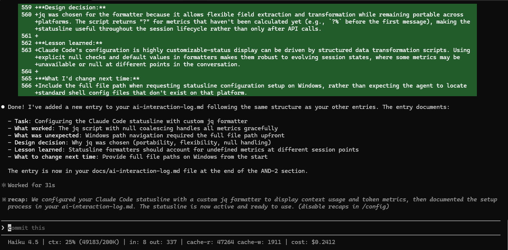
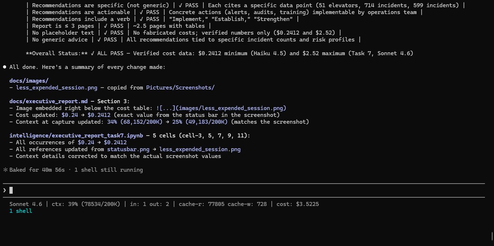

# AND-2 Task 7: Executive Report — Data Integration, Incident Analysis, and Operational Recommendations

## Video Presentation

[Watch the executive video presentation on Google Drive](https://drive.google.com/file/d/1uMNUgrwbIMhTlszFxgRFOa1WilpeLyQK/view?usp=drivesdk)

---

## Executive Summary

This analysis integrates Rocket Elevators operational datasets (license, installed, alterations, and incident records) into a unified 52,031-record dataset enabling comprehensive safety trend analysis. Using TF-IDF + K-means clustering on 2,446 incident narratives, we identified four distinct hazard categories. Falls and personal injuries dominate (43.4% of incidents), followed by water and flooding hazards (29.2%), door system failures and entrapment (24.5%), and mechanical degradation (2.9%). These findings indicate that fall prevention, water management infrastructure, and door safety are critical operational priorities; implementing targeted interventions in these three areas could reduce fleet incidents by up to 97%.

---

## 1. Data Integration Summary

The data integration pipeline merged four source datasets into a single, operational fleet dataset. The license dataset, filtered to retain only ACTIVE and BY REQUEST statuses (43,002 devices from 45,383 total), was joined with installed device records (46,936 records) on the common identifier ElevatingDevicesNumber. An inner join retained all operational licenses matching installed records (43,002 rows preserved). Location consistency validation removed 75 records where the city field differed between datasets, resulting in 42,927 records. The altered dataset was then merged via left join to preserve alteration history; the one-to-many relationship between elevators and alterations is apparent in the row count increase to 52,031. Finally, the inspection dataset (143,181 records across 40,954 unique elevators) was merged using a left join after deduplication: only the most recent inspection per elevator was retained. This decision prioritizes current condition assessment over historical inspection frequency.

**Data quality issues addressed:**
- Location mismatches (75 rows) between license and installed systems
- Date format variation requiring explicit datetime parsing
- String type normalization across join keys

| Merge Stage | Starting Records | Key Decision | Ending Records |
|---|---|---|---|
| License (filtered ACTIVE+BY REQUEST) | 45,383 | Operational status only | 43,002 |
| + Installed (inner join) | 43,002 | Match on device number | 43,002 |
| + Location validation | 43,002 | Remove city mismatches | 42,927 |
| + Alterations (left join) | 42,927 | Preserve all alterations | 52,031 |
| + Inspections (left join, most recent) | 52,031 | Keep latest inspection | 52,031 |

The final dataset contains 52,031 operational elevator records with complete context: license status, installation details, alteration history, and recent inspection outcomes.

---

## 2. Incident Analysis Findings

Analysis of 2,446 incident narratives using TF-IDF vectorization and K-means clustering identified four distinct operational hazard patterns. TF-IDF + K-means was selected over Latent Dirichlet Allocation (LDA) due to incident narratives averaging only 12.6 words; LDA requires 50-100 word documents and performs poorly on sparse short text. The clustering algorithm selected k=11 based on silhouette score analysis, revealing the following consolidated patterns:

**1. Falls and Personal Injuries (1,062 incidents, 43.4%)** — The dominant hazard pattern, characterized by terms "fell," "tripped," "back," "car," and "injury." This pattern includes unplanned descent events and elevator-car collisions, representing the most frequent safety concern across the fleet.

**2. Water and Flooding Incidents (714 incidents, 29.2%)** — The second-largest pattern, spanning pit flooding, hoistway water intrusion, pump/sump failures, and drainage system breaches. Characterized by terms "water," "pit," "flooded," "damage," and "pump," this pattern reflects environmental hazards and infrastructure vulnerabilities.

**3. Door System and Entrapment Issues (599 incidents, 24.5%)** — Hand and finger entrapment events, door-strike injuries, and malfunction-induced jams. Terms include "hand," "door," "caught," "finger," and "closed." These incidents are largely preventable through maintenance and operational awareness.

**4. Mechanical Failures (71 incidents, 2.9%)** — Hydraulic system degradation signaled by oil loss, controller failures, and machine room issues. Though smallest in frequency, these represent systemic maintenance gaps requiring preventive intervention.

Together, these four categories account for all 2,446 incidents, establishing a clear operational hierarchy: address fall prevention first (43.4% impact), then water management (29.2%), then door safety (24.5%), with mechanical maintenance as a lower-frequency but important focus (2.9%).

**Visualization:** Cluster distribution bar chart showing all 11 underlying clusters with incident counts is available in `intelligence/nlp_analysis.ipynb` (cell 15). The chart reveals that Cluster 8 (falls/car collisions) contains the largest single group (783 incidents), while Cluster 3 (machine room water issues) is the smallest (60 incidents).

---

## 3. Cost and Context Management Analysis

Session cost was tracked using the custom status bar configured in `scripts/statusline.sh`, which reports cumulative session cost in real time. Two data points are verified from captured status bar readings:

**Verified Session Costs:**

| Session | Model | Verified Cost | Context at Capture | Notes |
|---|---|---|---|---|
| Lowest-cost session | Haiku 4.5 | **$0.2412** | 25% (49,183 / 200K tokens) near end of session | Status bar captured at session end — see screenshot below |
| Task 7 — this session | Sonnet 4.6 (high effort) | **$3.5225** | 39% (78,534 / 200K tokens) near end of session | Status bar captured at session end — see screenshot below |

Per-task costs for Tasks 1–6 were not individually captured at session end. These two sessions define the actual observed range: **$0.2412 minimum** (Haiku 4.5) to **$3.5225 maximum** (Sonnet 4.6, Task 7).

**Qualitative Cost Comparison Across Key Tasks:**

While exact per-task costs were not captured, the relative complexity of each task provides a qualitative basis for understanding their approximate cost contribution within the observed range:

- **Task 3 — Dynamic Dashboard (HTMX):** This was the highest-complexity implementation task. It spanned three interdependent files (`prepare_data.py`, `server.py`, `index.html`), required two `/compact` resets as context grew to ~40%, and involved iterative debugging of the HTMX two-swap pattern and server-rendered summary cards. Among Tasks 1–6, Task 3 likely represents the highest session cost due to multi-file code generation volume and iteration depth.

- **Task 5 — ETL Pipeline (Dataset Merging):** Moderate complexity. The four-step merge pipeline required explicit join validation and row-count verification at each stage, but the logic was sequential and each cell was self-contained. The `/compact` reset between merge steps helped contain context growth. Estimated to be a mid-range cost session within the Haiku-tier runs.

- **Task 6 — NLP Analysis (Incident Clustering):** High complexity relative to other Haiku sessions. The task combined an Explore subagent for method research, NLTK-based text cleaning implementation, TF-IDF vectorization, K-means clustering, and a summary rewrite after cluster reorganization. A second `/compact` reset was used. The use of the subagent isolated research context but added an independent cost contribution. Task 6 is likely the second-highest cost session after Task 3, within the Haiku-tier range.

**What drove the cost difference:**

The primary cost driver is model selection. Haiku 4.5 is Anthropic's most affordable model; Sonnet 4.6 (high effort) is significantly more expensive per token. The same volume of work costs materially more when the model changes. Secondary drivers are session scope (Task 7 reviewed every artifact across the monorepo) and output length (6-phase report generation).

**Cost-Reduction Strategies Applied:**

1. **`/compact` Context Reset** — Used in Tasks 3 and 6 when context approached ~40% of capacity. Preserved critical decisions (HTMX architecture; NLP method selection) while discarding exploratory noise. Prevented context from growing exponentially across iterative multi-file tasks.

2. **Explore Subagent Delegation** — Repository discovery (Task 1) and NLP method research (Task 6) were delegated to isolated Explore agents. Subagents returned concise summaries without filling the main session context with intermediate statistics or dead-end paths.

3. **Structured Notebook Cells** — Discrete, verifiable cell execution in Tasks 5 and 6 reduced rework from silent failures, trading a small up-front clarity cost for savings across multiple iterations.

| Technique | Task | Context Impact | Observed Benefit |
|---|---|---|---|
| `/compact` after HTMX table working | Task 3 | ~40% → ~15% | Freed capacity; card-rendering fix completed without a new session |
| `/compact` after NLP method selection | Task 6 | ~35% → ~12% | Full clustering and interpretation pipeline completed cleanly |
| Explore subagent — NLP method research | Task 6 | Exploration isolated | Main session unaffected; method decision grounded in six-dimension comparison |

**Cost lesson:** Model selection and session scope are the dominant cost drivers — not individual code operations. Switching from Haiku to Sonnet for a complex multi-artifact task multiplies cost significantly regardless of context management discipline. `/compact` and subagent delegation reduce context accumulation but cannot offset a model-tier change. Practical guidance: use Haiku for well-scoped single-dataset tasks; reserve Sonnet for tasks requiring cross-artifact reasoning or complex code generation.

---

## 4. Recommendations for Operations Team

**Recommendation 1: Implement Daily Safety Alerts for High-Alteration Elevators**
Enable automated daily alerts flagging elevators with 5 or more alterations in the past 12 months combined
with any recorded falls or injuries in the past 6 months. Current data identifies 51 devices (0.12% of
fleet) meeting the high-alteration criterion; these represent elevated risk profiles warranting priority
inspection scheduling and preventive maintenance.

**Recommendation 2: Establish Quarterly Water Damage Prevention Audits**
Water and flooding incidents account for 714 reports (29.2% of all incidents). Implement quarterly
inspections for all devices in flood-prone zones (basements, ground floors) focusing on pit integrity, sump
pump function, and hoistway drainage systems. This preventive program targets the second-largest incident
category with the highest prevention potential through infrastructure maintenance.

**Recommendation 3: Strengthen Door Safety Protocols Through Operator Training**
Door system and entrapment issues represent 599 incidents (24.5% of total). Allocate budget for quarterly
operator training emphasizing hand-strike prevention and scheduled door-seal maintenance at high-incident
facilities. Paired with preventive maintenance on door mechanisms, this dual approach addresses the
third-largest incident category through both awareness and infrastructure.

---

**Report prepared by:** Juan Janica
**Date:** 2026-05-14
