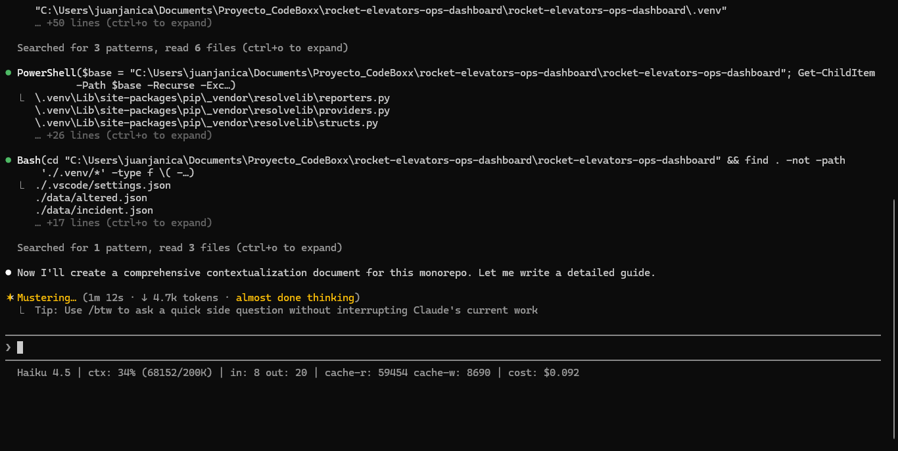

# Claude Code Status Bar — Notes

## What the status bar shows

The status bar is rendered by `scripts/statusline.sh`.  
It is invoked automatically by Claude Code before each prompt; the script
receives a JSON object on stdin and prints a single line of text.

### Example output during an active session

```
Claude Sonnet 4.6 | ctx: 12% (24350/200K) | in: 3210 out: 847 | cache-r: 18920 cache-w: 2180 | cost: $0.0043
```



---

## Field-by-field explanation

| Field | JSON source | Description |
|---|---|---|
| **model name** | `.model.display_name` | Human-readable name of the currently active Claude model (e.g. "Claude Sonnet 4.6"). Falls back to `.model.id` if the display name is absent. |
| **ctx %** | `.context_window.used_percentage` | Percentage of the model's total context window that has been consumed by the current conversation, floored to a whole number. |
| **tokens (used/max)** | `.context_window.total_input_tokens` / `.context_window.context_window_size` | Total input tokens accumulated in the context window this session, shown against the model's maximum window size (abbreviated to "K"). |
| **in** | `.context_window.current_usage.input_tokens` | Number of input tokens sent in the most recent API request (excludes cache hits). |
| **out** | `.context_window.current_usage.output_tokens` | Number of output tokens generated in the most recent API response. |
| **cache-r** | `.context_window.current_usage.cache_read_input_tokens` | Tokens read from the prompt cache in the most recent request (see below). |
| **cache-w** | `.context_window.current_usage.cache_creation_input_tokens` | Tokens written into the prompt cache during the most recent request (see below). |
| **cost** | `.cost.total_cost_usd` | Estimated cumulative USD cost for the session. Omitted when the field is not present in the JSON payload. |

---

## Cache read tokens vs cache creation tokens

Claude's API supports **prompt caching**, which lets repeated portions of a
prompt (system prompts, long documents, tool definitions, etc.) be stored
server-side and reused across requests.

### cache_creation_input_tokens (`cache-w`)

When the API encounters prompt content that has been marked for caching but
does **not** yet exist in the cache, it must process and store that content.
The tokens consumed during this "write" pass are counted as
`cache_creation_input_tokens`.  Writing to the cache is slightly **more
expensive** than a normal input token because extra work is performed to store
the representation.  This cost is only paid once per cache entry.

### cache_read_input_tokens (`cache-r`)

On subsequent requests that include the same cacheable prefix, the API
retrieves the pre-computed representation from the cache instead of
reprocessing the raw text.  The tokens consumed this way are counted as
`cache_read_input_tokens`.  Reading from the cache is significantly **cheaper**
than a normal input token (roughly 10 % of the standard input price), and it
also reduces latency because less text needs to be processed from scratch.

### Practical interpretation

| Observation | Likely meaning |
|---|---|
| `cache-w` is large on the first message | The system prompt and/or attached documents were written into the cache. |
| `cache-r` is large on subsequent messages | Those same tokens are being served from the cache — you are saving money and time. |
| Both are zero | Caching is not active for this request (short context, no cache breakpoints set, or model does not support caching). |
| `cache-w` appears on every message | The cacheable content is changing each turn, preventing cache reuse. |

In a well-configured long session the pattern you want to see is a single large
`cache-w` spike on the first turn followed by a matching large `cache-r` on
every subsequent turn, with `in` (non-cached input) remaining small.

---

## How the script works

`scripts/statusline.sh` reads the entire stdin payload into a shell variable
and then passes it to `jq -r` for parsing.  All field extraction uses `jq`
path expressions — no string manipulation (awk, sed, grep, cut) is used.
Default values (`// 0`, `// null`) are applied inside `jq` so the script
produces sensible output even before the first API call has been made.

The Claude Code `statusLine` command is configured in
`~/.claude/settings.json`:

```json
{
  "statusLine": {
    "type": "command",
    "command": "bash C:/Users/juanjanica/Documents/Proyecto_CodeBoxx/rocket-elevators-ops-dashboard/rocket-elevators-ops-dashboard/scripts/statusline.sh"
  }
}
```
